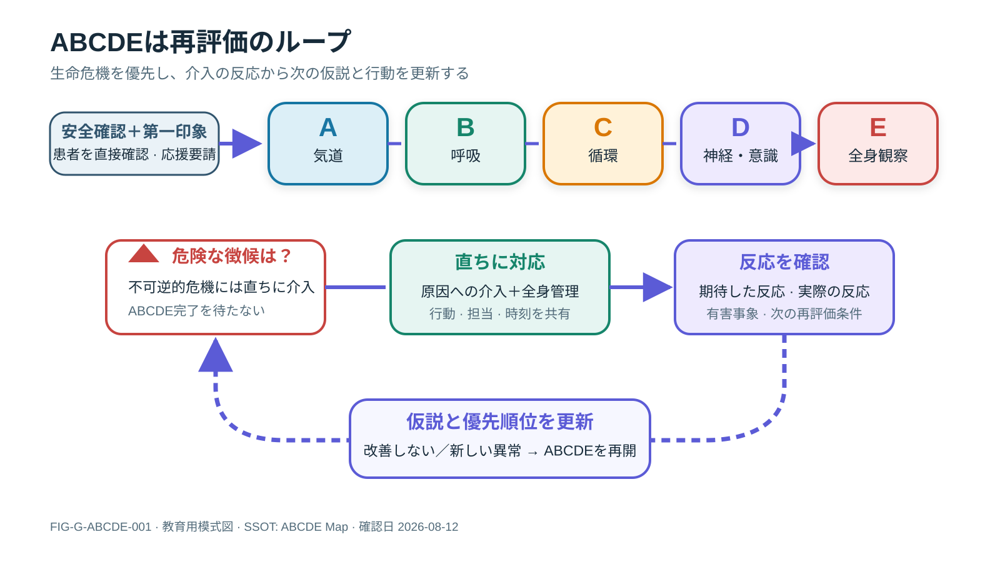
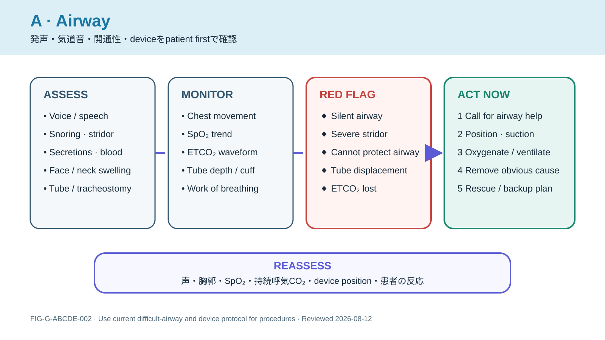
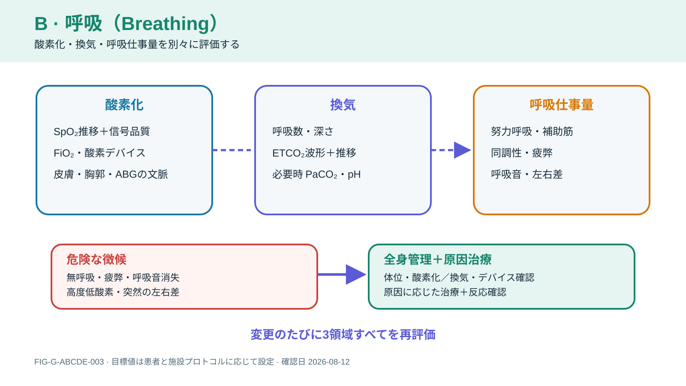
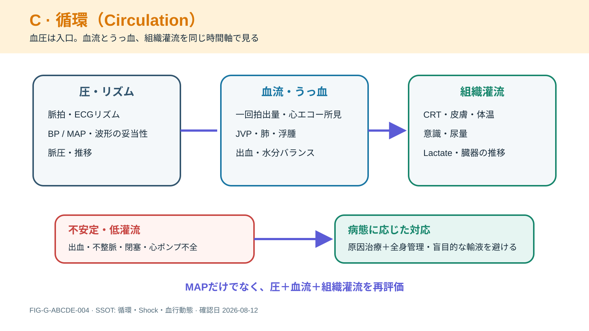
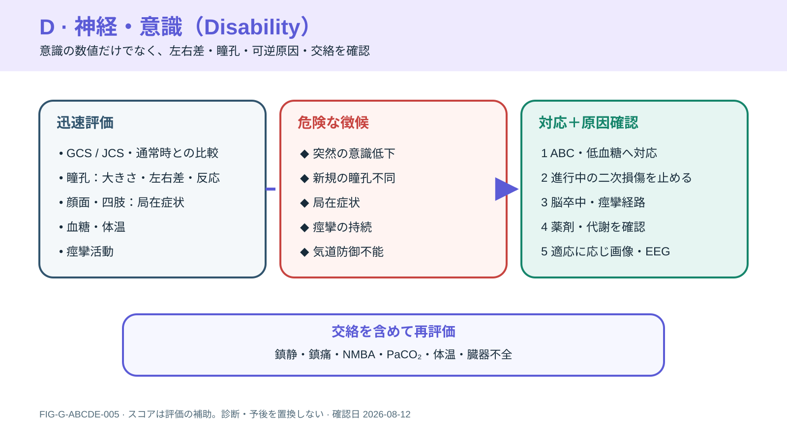
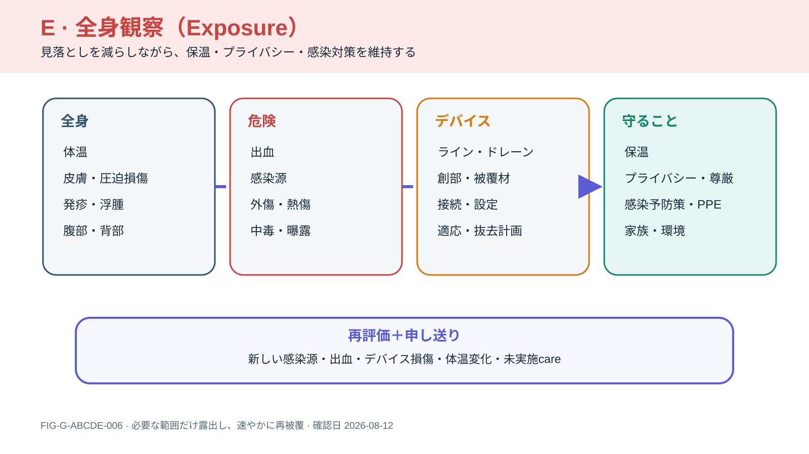

# ABCDE Map

ABCDEは章ではなく、全ページを横断する初期評価と再評価の共通言語です。

## Visual Series: ABCDE + Reassessment

**Figure FIG-G-ABCDE-001 — ABCDE reassessment loop.** Safety/第一印象からABCDEへ進み、red flagには完了を待たず介入し、反応から仮説と優先順位を更新する循環を示す。見るべき点は、ABCDEが一方向のchecklistではなく、介入後に必ず患者へ戻ること。

### Figure Interpretation

上段は生命危機を見落とさない共通言語、下段は「異常発見→即時介入→反応確認→仮説更新」を示す。チームは同時並行に動けるが、誰が何を行い、何で成功/害を判断するかを共有する。

### Clinical Meaning

単一のmonitor値や臓器だけを治療せず、最も危険な生理を優先する。改善しない、新しい異常が出る、介入が害を生む場合はABCDEを再開し、escalation/handoffへつなぐ。

### A–E detail figures

**Figure FIG-G-ABCDE-002 — Airway pass.** 発声・気道音・分泌物・deviceから開通性を評価し、持続呼気CO₂を含む反応確認までを示す。procedureやdoseは最新の気道/施設protocolを用いる。

**Figure FIG-G-ABCDE-003 — Breathing pass.** Breathingをoxygenation、ventilation、work of breathingへ分解する。SpO₂だけが正常でも換気不全や疲弊は除外できない。

**Figure FIG-G-ABCDE-004 — Circulation pass.** pressure、flow/congestion、tissue perfusionを統合する。MAPだけでなくCRT、意識、尿量、lactate/臓器trajectoryを介入前後で比較する。

**Figure FIG-G-ABCDE-005 — Disability pass.** 意識、瞳孔、局在、血糖、痙攣と交絡を短時間で整理する。scoreは診断や予後の代替ではない。

**Figure FIG-G-ABCDE-006 — Exposure pass.** 体温、皮膚、出血、感染源、外傷、deviceと環境を確認しつつ、保温、privacy、感染対策を維持する。

### Figure Interpretation

詳細図はすべて`Assess → Red flag → Action → Reassess`の共通grammarを使う。色だけでなく、assessment card、赤枠、action card、再評価枠の形で意味を区別している。

### Clinical Meaning

各図はbedside dosing/procedure cardではない。異常の早期認識、必要な専門teamの招集、local protocolへ接続するためのmental modelとして用いる。SVGは[Figure Index](../../../FIGURE_INDEX.md)から単独取得し、PowerPointへ再利用できる。

| 領域 | 最初に見ること | 主なリンク |
|---|---|---|
| A | 発声、気道音、開通性、分泌物、気道デバイス、ETCO₂ | [Airway](../../01_Airway/README.md) |
| B | 呼吸数・仕事量、胸郭、SpO₂、換気、波形、ABG | [Breathing](../../02_Breathing/README.md) |
| C | 脈拍、血圧、CRT、皮膚、意識、尿量、lactateと推移 | [Circulation](../../03_Circulation/README.md) |
| D | GCS/JCS、瞳孔、局在、血糖、鎮静、痙攣 | [Neurology](../../04_Neurology/README.md) |
| E | 体温、皮膚、出血、感染源、外傷、drain、環境、家族 | [Topic Map](../../TOPIC_MAP.md) |

## 共通ループ

**安全確認 → 第一印象 → ABCDE → 緊急介入 → 反応の再評価 → 詳細評価 → 仮説更新 → escalation / handoff**

数値や機器アラームだけでなく、まず患者を直接評価します。ABCDEは同時並行のチーム対応を妨げる直線的手順ではなく、生命危機を見落とさず優先順位を共有する枠組みです。

## Reassessment and handoff

介入ごとに「何を変えたか」「期待した反応」「実際の反応」「有害事象」「次のtrigger」を確認します。handoffはpatient identity、current threat、trajectory、airway/oxygen/device/infusion、pending result、treatment limit、contingency、受け手のread-backを含めます。

> [!DANGER]
> ABCDEの完了を待って不可逆的な生命危機への介入を遅らせない。同時に、単一の異常値だけを治療して患者全体の悪化を見失わない。

## References

- WHO/ICRC. [Basic Emergency Care](https://www.who.int/publications/i/item/basic-emergency-care-approach-to-the-acutely-ill-and-injured). 2018.

## Figure review log

- 2026-08-12: 図内表記を日本語中心へ統一し、臨床で必要な略語・初出英語のみ維持。再描画して文字切れを確認。
- 2026-08-12: FIG-G-ABCDE-001–006を追加。ABCDE本文、Airway/Breathing/Circulation/Neurology/Trauma/Infection各SSOTと照合し、SVG/XML、label、矢印、16:9 readabilityを確認。
