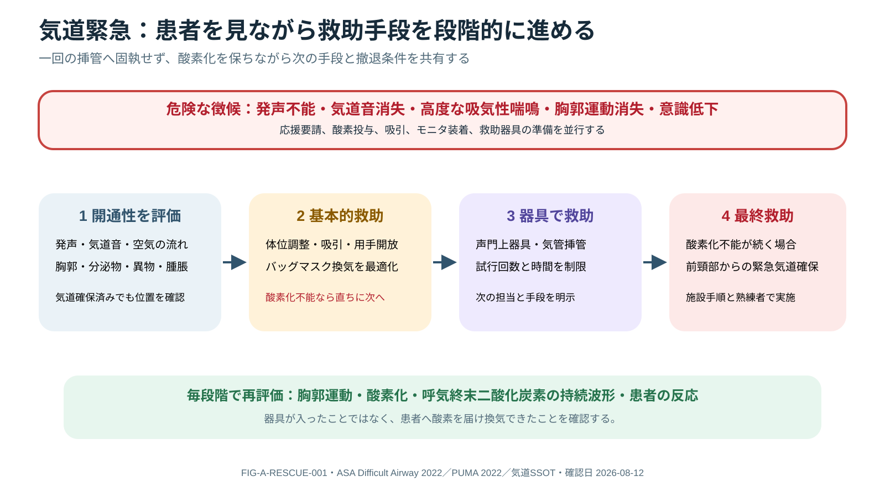

# 気道評価と気道緊急事態

> [!CAUTION]
> 気道閉塞は短時間で不可逆的障害へ進みます。評価と同時に応援、酸素化、吸引、basic airway maneuver、rescue device、外科的気道の準備を進め、施設のairway algorithmを優先してください。

## この章の使い方

- **新人看護師：** 「気道とは」「音と見た目」「危険徴候」「報告例」を先に確認します。
- **中堅・ベテラン：** 解剖学的困難と生理学的困難、悪化予測、救済経路の切り替えまで確認します。

## 1. まず覚える

**気道（airway）**とは、鼻・口から咽頭、喉頭、気管を通って肺へ空気が出入りする通り道です。

**簡単に言うと：** Aの評価は「いま空気が通るか」「今後も通り続けるか」「閉塞したら酸素化を救えるか」を確認することです。

| 用語 | 意味 | ベッドサイドでの見方 |
|---|---|---|
| 開通性（patency） | 空気の通り道が保たれていること | 発語、airflow、呼吸音、胸郭運動を確認 |
| stridor | 主に上気道狭窄で生じる高調な呼吸音 | 音の強さだけで重症度を判断しない。完全閉塞では無音になり得る |
| snoring | 舌根沈下などで生じるいびき様音 | 意識、頭位、下顎、airflowを確認 |
| gurgling | 血液・分泌物・嘔吐物を疑う湿性音 | 吸引準備、誤嚥、換気状態を確認 |
| SGA | 声門上器具（supraglottic airway） | mask換気や挿管が困難な際の救済器具 |
| FONA | 前頸部からの緊急気道確保（front-of-neck airway） | 挿管も酸素化もできない状況の救済経路 |

## 2. 新人看護師の到達目標

1. 会話できるか、異常音があるか、胸郭が動くかを短時間で確認できる。
2. SpO₂低下を待たず、進行する腫脹、嗄声、流涎、疲弊を報告できる。
3. 応援要請、酸素、吸引、bag-mask、monitorの準備を同時に進められる。
4. 一時的に改善しても再閉塞を考え、繰り返し評価できる。

## 3. Overview



**Figure FIG-A-RESCUE-001 — 気道緊急時の救助。** 患者で気道開通性を確認し、基本的救助、声門上器具・気管挿管、必要時の前頸部からの緊急気道確保へ段階的に進む。各段階で胸郭運動、酸素化、呼気終末二酸化炭素（end-tidal carbon dioxide：ETCO₂）の持続波形、患者反応を再評価する。

Airway評価の中心は「今開通しているか」「維持できるか」「悪化したらoxygenateできるか」です。会話可能でも、浮腫・血腫・熱傷・分泌・疲弊は進行し得ます。

## 4. なぜ小さな狭窄が危険なのか

上気道抵抗は半径低下で急増します。意識低下による舌根沈下、分泌/血液/嘔吐物、異物、laryngospasm、浮腫、外傷、腫瘤が閉塞を起こします。完全閉塞ではair movementが消え、stridorが聞こえなくなることがあります。

## 5. Bedside Assessment

- **Look:** 発語、意識、姿勢、陥没呼吸、胸郭運動、外傷/熱傷/浮腫、唾液
- **Listen:** voice change、stridor、snoring、gurgling、silent airway
- **Feel:** airflow、皮下気腫、頸部腫脹、tracheal position
- oxygenation、ventilation、循環を同時評価し、SpO₂低下を待たない
- difficultyはmouth opening、頸部可動、顔面/頸部形態、肥満、既往、歯、分泌/血液、aspiration risk、physiologic reserveを組み合わせる。単一screenは除外に不十分

### 観察を行動へつなげる

| 観察 | 意味する可能性 | 次に確認・準備すること |
|---|---|---|
| 声が出ない、弱い | 高度閉塞、意識低下、疲弊 | airflow、胸郭、意識、応援、換気準備 |
| 嗄声、stridor、流涎 | 喉頭周囲の狭窄・浮腫 | 進行速度、原因、挿管困難、救済器具 |
| gurgling、口腔内血液 | 分泌物・血液・嘔吐物 | 吸引、誤嚥、酸素化、出血源 |
| 胸郭運動低下、silent airway | 完全閉塞または著しい換気不全 | 緊急応援、bag-mask、救済経路 |

### 報告例

> 「Aに異常があります。嗄声と吸気性stridorが10分で増悪し、会話は単語のみです。SpO₂は酸素○○下で○○%、頸部腫脹は○○、airflowは○○です。応援要請、吸引、bag-maskと挿管器材の準備を開始しています。」

## 6. Clinical Reasoning

```text
声/airflow異常 → 応援と酸素 → 開通maneuver/吸引/異物対応
→ bag-maskでoxygenateできるか → supraglottic rescueを準備
→ definitive airwayの必要性と難易度 → awake/induction pathwayを選択
→ cannot intubate/cannot oxygenateなら緊急侵襲的気道algorithm
```

評価は連続的に行い、成功した一時的介入後も再閉塞を想定します。

## 7. Treatment Principles and Team Roles

患者に適したhead/neck position、jaw thrust/chin lift（頸椎損傷を考慮）、suction、OPA/NPA、bag-mask、supraglottic airwayを段階的に用います。異物、anaphylaxis、感染、血腫等の原因治療を並行します。NPAは頭蓋底/鼻腔損傷等の文脈で慎重に判断します。

## 8. Nursing Practice

- airway cart、suction 2系統、酸素、bag-mask、capnography、rescue device、front-of-neck kitの場所を把握
- difficult airway history、device/size、成功手技、grade、合併症を明確にhandoff
- 口腔内分泌、voice、嚥下、腫脹のtrendを記録し、悪化を早期報告
- 挿管中は役割、closed-loop communication、attempt/time、SpO₂/血圧を記録

**介入後の再評価：** 発語、airflow、胸郭運動、呼吸音、SpO₂、ETCO₂、意識、循環を再確認し、「改善したか」「一時的か」「次の手段が必要か」を共有します。

## 9. ベテラン看護師向け深掘り

解剖学的に挿管しやすくても、低酸素、shock、重度acidosis、右心不全、頭蓋内病態では無呼吸や陽圧換気に耐えられないことがあります。器具の準備だけでなく、preoxygenation、循環、体位、attempt制限、mask/SGA/FONAの移行条件をbriefingで明確にします。

## 10. Red Flags / Pitfalls

- silent airway、cyanosis、意識低下、疲弊、急速な頸部腫脹、顔面熱傷、拡大する血腫
- difficult intubationだけを予測しmask/SGA/FONA difficultyを考えない
- 複数回attemptで浮腫・出血を増悪、SpO₂低下まで応援を呼ばない

## 11. 確認問題

1. stridorが消失したとき、改善と決めつけられないのはなぜですか。
2. Aの異常を報告するとき、音以外に何を伝えますか。
3. 一時的にairway maneuverで改善した後、何を再評価しますか。

## 12. Take Home Messages

1. 気道は現状だけでなく悪化予測とrescue planで評価する。
2. 評価・oxygenation・応援要請は同時進行。
3. attemptを重ねる前にstrategyを変え、常に出口を確保する。

## 13. References

- Apfelbaum JL, et al. 2022 ASA Practice Guidelines for Management of the Difficult Airway. Anesthesiology. DOI: 10.1097/ALN.0000000000004002; PMID: 34762729.

## Review Log

| Date | Reviewer | Scope | Result |
|---|---|---|---|
| 2026-08-12 | Codex | V2 terminology / novice-to-expert nursing / bedside escalation | Rewritten for staged learning; airway expert and nurse educator review needed |
| 2026-08-11 | Codex | guideline / ABCDE / nursing | Evidence reviewed; airway expert and local algorithm review needed |
