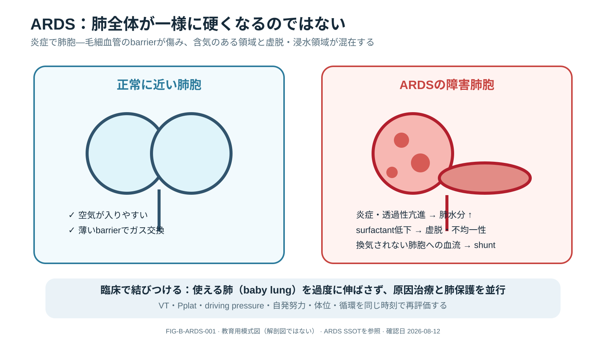
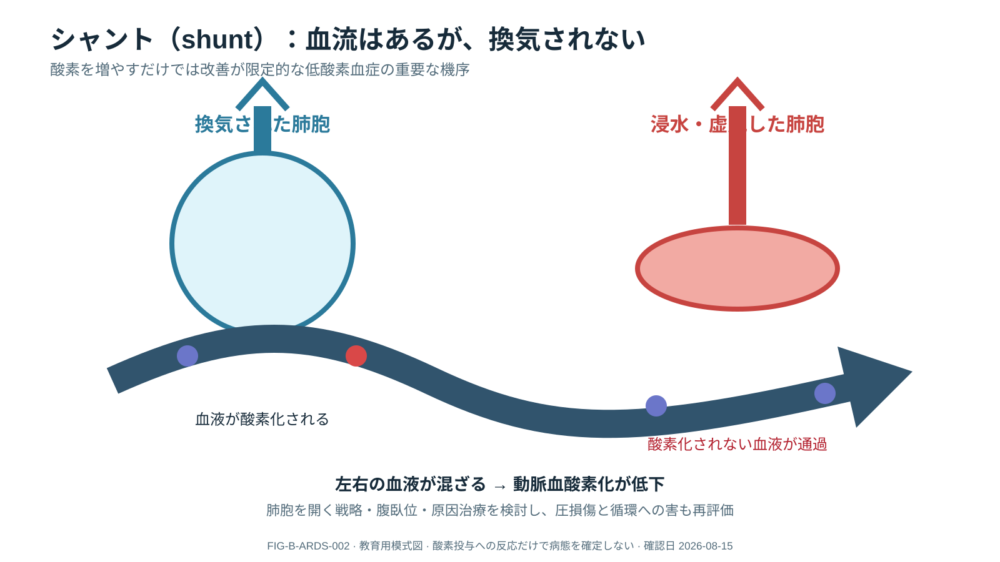
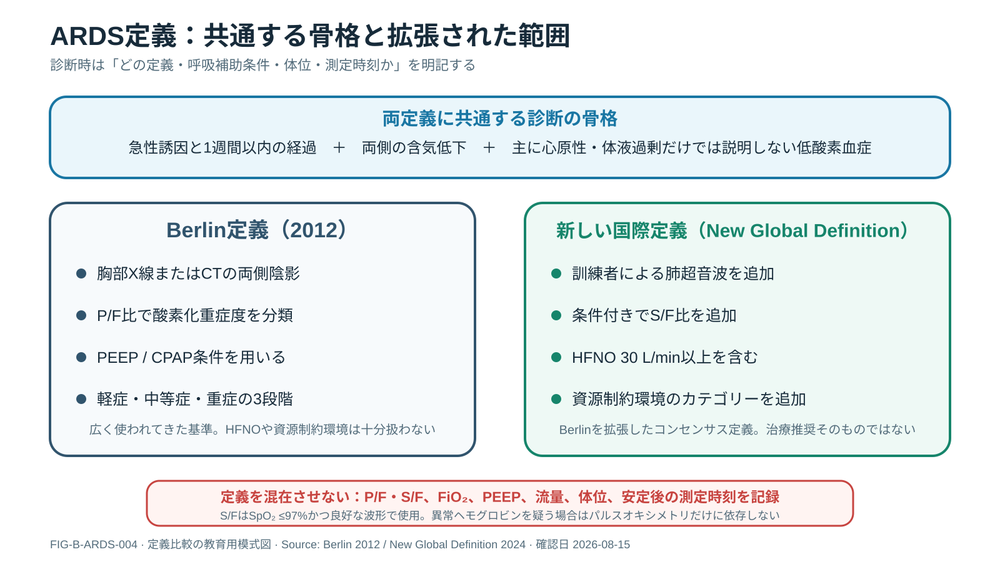
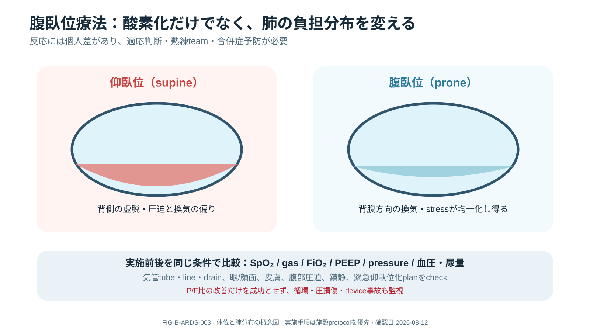

# 急性呼吸窮迫症候群（ARDS）

> [!CAUTION]
> この章は成人ARDSの教育資料です。ARDSは単一疾患ではなく症候群であり、定義を満たすかだけで治療を決めません。原因治療、肺保護、循環・右心、体液、感染、鎮静・離床を患者ごとに統合します。

## 0. Executive Summary — Quick Review

### 一言でいうと

**[FACT] [CLM-ARDS-001] 急性呼吸窮迫症候群（acute respiratory distress syndrome: ARDS）**は、肺炎、肺外感染、誤嚥、外傷、輸血、熱傷、ショックなどを契機とする急性・びまん性の炎症性肺傷害です。肺血管・上皮の透過性亢進、肺水分増加、重力依存性無気肺により、換気可能な肺が減少します。[SRC-ARDS-001]

**簡単に言うと：** 肺全体が均一に悪くなるのではなく、開いている領域、虚脱した領域、液体で満たされた領域、過膨張しやすい領域が混在します。酸素化を支えるだけでなく、残った肺を人工呼吸で傷つけないことが重要です。

### 新人看護師の到達目標：最初にそろえる情報

- 現在の酸素投与・呼吸補助：器具、吸入酸素濃度（FiO₂）、流量、PEEP、体位。
- 患者反応：SpO₂と波形、呼吸数、努力、意識、血液ガス、胸郭・呼吸音。
- 人工呼吸中：呼気一回換気量、予測体重、Pplat、総PEEP、波形、非同調。
- 全身：血圧、末梢循環、尿量、体液出納、右心負荷を疑う所見、皮膚・眼・ライン。
- 介入前後：何をいつ変え、酸素化、圧、循環、患者努力、有害事象がどう変化したか。

### ベテラン向け深掘り：数値を文脈化する

- P/F比、SpO₂、プラトー圧、駆動圧を単独で扱わず、FiO₂、PEEP、体位、測定時刻、患者努力、胸壁・腹腔内圧、循環と併せて解釈する。
- 推奨の強さと患者選択を区別し、介入後は酸素化だけでなく肺・右心・全身循環・鎮静負荷・機器関連有害事象まで再評価する。

### Red Flags

- 酸素投与を強めても進行する低酸素血症、疲弊、意識低下。
- 急な気道内圧上昇、片側呼吸音低下、血圧低下：気管チューブ・回路問題、気胸等を緊急評価。
- 新規または進行するショック、右室不全、不整脈、尿量低下。
- 腹臥位中の気管チューブ・ライン・ドレーン逸脱、顔面・眼・神経・皮膚障害。

## 1. 重要用語

| 用語 | 簡単な意味 | 混同しないこと |
|---|---|---|
| シャント（shunt） | 換気されない肺胞を血液が通る | 酸素投与への反応だけで割合を確定しない |
| 肺保護換気 | 過大な容量・圧と反復虚脱を抑える戦略 | 一つの数値だけで「保護できた」と判断しない |
| 人工呼吸器関連肺傷害（VILI） | 人工呼吸に関連する追加肺傷害 | 気道内圧だけでは局所の傷害を直接測れない |
| P/F比 | PaO₂ ÷ FiO₂ | FiO₂、PEEP、体位、時刻、測定安定性が必要 |
| 腹臥位療法 | うつ伏せで換気・灌流・肺応力分布を変える治療 | 単なる体位変換ではなく多職種の高リスク介入 |
| 肺リクルートメント | 虚脱肺を開通させようと一時的に圧を加える考え方 | routineの長時間手技は推奨されない |

## 2. 病態生理 — Core

**Figure FIG-B-ARDS-001 — 肺胞障害と不均一な肺**

- **Figure Claim:** 透過性亢進、肺胞水分、サーファクタント機能障害、虚脱が混在し、換気可能な肺が小さくなる。
- **最初に見る場所:** 正常肺胞と、液体貯留・虚脱・不均一性を示すARDS側を比較する。
- **判断限界:** 病理標本やCTの定量図ではなく、病期・原因ごとの差を表していない。

肺内の不均一性により、同じ気道内圧でも局所の応力と変形は異なります。過伸展、反復開閉、高い局所圧、強い自発努力、炎症反応が追加傷害に関係します。一方、過度な鎮静や筋弛緩にも害があるため、患者努力を単純に消せばよいわけではありません。

**Figure FIG-B-ARDS-002 — シャントと低酸素血症**

- **Figure Claim:** 換気されない肺胞に血流が残ると、酸素化されない血液が動脈側へ混ざる。
- **Clinical Meaning:** SpO₂低下を酸素濃度だけで追わず、肺胞虚脱・充満、分泌物、体位、循環を評価する。
- **判断限界:** シャント率を定量化せず、高濃度酸素への反応だけで原因を確定できない。

## 3. 診断：Berlin定義と新しい国際定義（New Global Definition）

**[FACT] [CLM-ARDS-002]** New Global DefinitionはBerlin定義を拡張し、高流量鼻カニュラ酸素療法中の非挿管患者、条件を満たすSpO₂/FiO₂、訓練された実施者による肺超音波、資源制約環境のカテゴリーを含めました。[SRC-ARDS-001]

**Figure FIG-B-ARDS-004 — 定義の使い分け**

| 項目 | Berlin定義 | New Global Definition |
|---|---|---|
| 時間 | 既知の侵襲または呼吸症状の発生・悪化から1週間以内 | 1週間以内を維持 |
| 誘因・肺水腫 | 心原性肺水腫・体液過剰だけでは説明しない | 急性誘因を明記。併存していても主因を臨床判断 |
| 画像 | 胸部X線またはCTの両側陰影 | X線・CTに加え、訓練者による肺超音波を許容 |
| 酸素化 | P/F比とPEEP/CPAP条件 | P/Fに加え条件付きS/F比、HFNOカテゴリーを追加 |
| 非挿管 | CPAPを一部含む | HFNO 30 L/min以上を用いるカテゴリーを追加 |
| 資源制約環境 | 十分に対応しない | 修正版カテゴリーを用意 |

> [!IMPORTANT]
> New Global Definitionは専門家コンセンサスによる症候群定義で、GRADE治療ガイドラインではありません。どの定義を使ったか、呼吸補助条件、FiO₂、体位、測定時刻を記録してください。

### Berlin定義を用いる場合の酸素化重症度

PEEPまたはCPAP 5 cmH₂O以上で、P/F比が200超〜300以下を軽症、100超〜200以下を中等症、100以下を重症とします。これは診断・重症度分類であり、単一時点の値だけで予後や治療を自動決定しません。[SRC-ARDS-002]

### 新しい国際定義（New Global Definition）を用いるときの測定上の注意

- 体位、FiO₂、流量を変更後、安静かつ安定した条件で評価する。
- SpO₂/FiO₂を使う場合はSpO₂が97%以下で、波形品質とセンサー位置を確認する。
- 異常ヘモグロビンを疑う場合、診断目的にパルスオキシメトリだけを使わない。
- 肺超音波は訓練を受けた実施者が両側の含気低下を評価する。

## 4. 鑑別と原因評価

ARDSというラベルを付けても原因検索は終わりません。

- 肺炎、誤嚥、肺外感染・敗血症、外傷、輸血、熱傷、ショックなどの誘因。
- 心原性肺水腫・体液過剰、無気肺、胸水、肺胞出血、急性好酸球性肺炎、器質化肺炎、薬剤性肺障害など。
- 気道閉塞、気管チューブ位置、回路、気胸、肺塞栓など急速に修正可能な原因。
- ARDSと心不全・体液過剰は併存し得るため、二者択一にしない。

## 5. Evidence-based Management

### 肺保護換気

**[RECOMMENDATION] [CLM-ARDS-003]** 成人ARDSでは、予測体重あたり4〜8 mL/kgの低一回換気量とPplat 30 cmH₂O未満を用いる肺保護換気が強く推奨されています（確実性：中等度）。[SRC-ARDS-003]

- 予測体重は身長と生物学的性別から算出し、実体重を使わない。
- 呼気実測一回換気量、Pplatの測定条件、患者努力、総PEEP、pH・PaCO₂、非同調を統合する。
- 数値達成のために患者の苦痛、循環悪化、過度の鎮静などを見落とさない。

### PEEPと肺リクルートメント

**[RECOMMENDATION] [CLM-ARDS-004]** ATS 2024は、中等症〜重症ARDSで肺リクルートメント手技を伴わない高めのPEEPを低めのPEEPより提案しています（条件付き、確実性：低〜中等度）。長時間の肺リクルートメント手技には反対する強い推奨です（確実性：中等度）。[SRC-ARDS-004]

PEEPは酸素化だけでなく、Pplat・駆動圧、コンプライアンス、過膨張、死腔、血圧、右室、臓器灌流への反応で再評価します。全ARDS患者に共通する一つの最適値はありません。

### 腹臥位療法

**[RECOMMENDATION] [CLM-ARDS-005]** 2017 ATS/ESICM/SCCMガイドラインは重症ARDSで1日12時間を超える腹臥位を強く推奨しています（確実性：中等度）。主要試験PROSEVAでは早期かつ長時間の腹臥位戦略が評価されました。[SRC-ARDS-003][SRC-ARDS-005]

**Figure FIG-B-ARDS-003 — 腹臥位の機序と再評価**

- **Figure Claim:** 腹臥位は背腹側の換気、灌流、局所応力分布を変え、酸素化と肺保護に寄与し得る。
- **Clinical Meaning:** SpO₂の上昇だけでなく、気道・回路、圧、循環、顔面・眼・皮膚・神経、ラインを評価する。
- **判断限界:** 実施手順、除外基準、人数、鎮静・筋弛緩処方を示す図ではない。

### その他の補助療法

ATS 2024は、副腎皮質ステロイド、選択された重症ARDSへの静脈―静脈ECMO、早期重症ARDSへの筋弛緩薬をそれぞれ条件付きで提案しています。推奨の確実性、患者選択、薬剤・期間、専門体制が異なるため、固定レシピにしません。[SRC-ARDS-004]

## 6. ICU Nursing Pearls

### 観察と記録

- 身長、予測体重の計算根拠、実体重との区別。
- 体位、FiO₂、PEEP、呼気一回換気量、Pplat、SpO₂、血液ガスを同じ時刻で記録。
- 患者努力、呼吸数、波形、二重トリガー、無効努力、鎮静深度、疼痛。
- 血圧、末梢循環、尿量、体液出納、乳酸の推移、右心負荷を疑う変化。
- 気管チューブ、口腔、分泌物、加温加湿、カフ、回路、アラーム。

### 腹臥位の安全

施設チェックリストと訓練済みチームを用い、実施前に気道、固定、ライン、ドレーン、緊急時の仰臥位復帰計画を共有します。実施後はチューブ深さ・波形、換気、循環、眼・顔面、耳、胸部、骨盤、膝、末梢神経、皮膚を繰り返し確認します。

### 報告例

> 「ARDS管理中です。現在は腹臥位、FiO₂とPEEPは○○、SpO₂と直近PaO₂は○○です。呼気一回換気量は予測体重あたり○○、Pplatは測定条件○○で○○です。変更後、血圧・尿量・波形・皮膚は○○へ変化しました。未解決は○○です。」

### 介入後の再評価

| 介入 | 効果 | 害・限界 |
|---|---|---|
| FiO₂変更 | SpO₂、PaO₂、必要FiO₂の推移 | 酸素曝露、原因の未解決 |
| PEEP変更 | 酸素化、Pplat、駆動圧、コンプライアンス | 血圧、右心、過膨張、死腔 |
| 腹臥位 | 酸素化、圧、換気分布の手掛かり | 気道・ライン、循環、眼・顔面・皮膚・神経 |
| 鎮静・筋弛緩 | 努力、非同調、換気 | 低血圧、覚醒遅延、筋力低下、評価不能 |

## 7. Common Pitfalls

1. P/F比だけでARDSの原因、予後、治療反応を判断する。
2. Berlin定義とNew Global Definitionを混在させる。
3. 体位・FiO₂・PEEP・測定時刻を記録せず、異なる条件の値を比較する。
4. 実体重で一回換気量を計算する。
5. PEEPやFiO₂を上げた後、循環・右心・過膨張を再評価しない。
6. 腹臥位を酸素化が極端に悪化してから初めて検討する。
7. 波形異常を鎮静不足と決めつけ、原因を探さず鎮静だけを強める。

## 8. Mini Case

肺炎を契機に両側陰影と低酸素血症が進行した患者。FiO₂を上げるとSpO₂は一時改善しましたが、Pplatと血圧が悪化しました。

**考える順序：** 測定条件と定義を確認し、気道・回路・気胸など緊急原因を除外します。その上で一回換気量、Pplat、総PEEP、患者努力、循環・右心、体位、原因治療を統合し、PEEP・腹臥位等の利益と害を介入後に再評価します。

## 9. Take Home Messages

1. ARDSは急性・びまん性の炎症性肺傷害で、診断と原因治療を並行します。
2. 使用した定義、呼吸補助条件、体位、測定時刻を明記します。
3. 肺保護換気と重症ARDSの腹臥位には強い推奨があります。
4. PEEP、薬剤、筋弛緩、ECMOは対象と害を確認する条件付き介入です。
5. 介入後は酸素化だけでなく、圧、循環、右心、患者努力、機器、皮膚を再評価します。

## 10. Claim-level References

| Source ID | Title | Organization / Journal | Year / Status | Exact claim supported | Strength / certainty | Limits | DOI / PMID / Official URL | Verified on |
|---|---|---|---|---|---|---|---|---|
| SRC-ARDS-001 | A New Global Definition of Acute Respiratory Distress Syndrome | International consensus / AJRCCM | 2024 issue; consensus definition | CLM-ARDS-001〜002：概念モデル、時間、画像、HFNO、S/F、資源制約カテゴリー | Consensus definition; not a treatment recommendation | 今後の外部検証が必要。学会個別の正式承認を意味しない | DOI: 10.1164/rccm.202303-0558WS; PMCID: PMC10870872; https://doi.org/10.1164/rccm.202303-0558WS | 2026-08-15 |
| SRC-ARDS-002 | Acute Respiratory Distress Syndrome: The Berlin Definition | ARDS Definition Task Force / JAMA | 2012 | Berlin診断基準とP/F重症度 | Consensus definition | HFNO、S/F、肺超音波、資源制約環境を十分扱わない | DOI: 10.1001/jama.2012.5669; PMID: 22797452 | 2026-08-15 |
| SRC-ARDS-003 | Mechanical Ventilation in Adult Patients with ARDS | ATS/ESICM/SCCM / AJRCCM | 2017; retained recommendations where not updated | CLM-ARDS-003, 005：低VT・Pplat制限、重症ARDSの腹臥位 | strong; moderate certainty | 成人ARDS。患者努力・胸壁等に個別対応 | DOI: 10.1164/rccm.201703-0548ST; PMID: 28459336; https://www.thoracic.org/statements/resources/cc/ards-guidelines.pdf | 2026-08-15 |
| SRC-ARDS-004 | An Update on Management of Adult Patients with ARDS | ATS / AJRCCM | 2024; current final update | CLM-ARDS-004：PEEP・リクルートメント。ステロイド、VV-ECMO、筋弛緩 | recommendation-specific | 成人ARDS。薬剤量・期間、PEEP調整法を一律に定めない | DOI: 10.1164/rccm.202311-2011ST; PMID: 38032683; PMCID: PMC10870893 | 2026-08-15 |
| SRC-ARDS-005 | Prone Positioning in Severe ARDS (PROSEVA) | Guérin C, et al. / NEJM | 2013; landmark RCT | CLM-ARDS-005：早期・長時間腹臥位戦略の主要原著 | RCT | 熟練施設、選択患者、プロトコル全体として解釈 | DOI: 10.1056/NEJMoa1214103; PMID: 23688302 | 2026-08-15 |
| SRC-ARDS-006 | ARDS診療ガイドライン2021 | 日本集中治療医学会ほか | 2022 publication; Japanese guideline | 国内実装、呼吸管理、補助療法の比較参照 | recommendation-specific | ATS 2024と発行時期・問いが異なる | https://www.jsicm.org/publication/pdf/220728JSICM_ihardsg.pdf | 2026-08-15 |

## Human Review

- ARDS・人工呼吸専門医：定義、肺保護、PEEP、腹臥位、補助療法。
- ICU看護師：観察、腹臥位安全、報告、介入後再評価。
- 臨床工学技士・呼吸療法担当：波形、測定条件、機器依存事項。
- Evidence担当：New Global Definitionの外部検証と各ガイドライン更新監視。

## Review Log

| Date | Reviewer | Scope | Result | Remaining uncertainty |
|---|---|---|---|---|
| 2026-08-15 | Codex | definition / ATS 2017+2024 / Japanese guideline identity / nursing / figure claims | Major reconstruction | Specialist cross-review and full Japanese recommendation mapping required |
| 2026-08-12 | Codex | V2 terminology / nursing observation / advanced trade-offs | Staged-learning introduction added | Claim-level mapping was incomplete |
