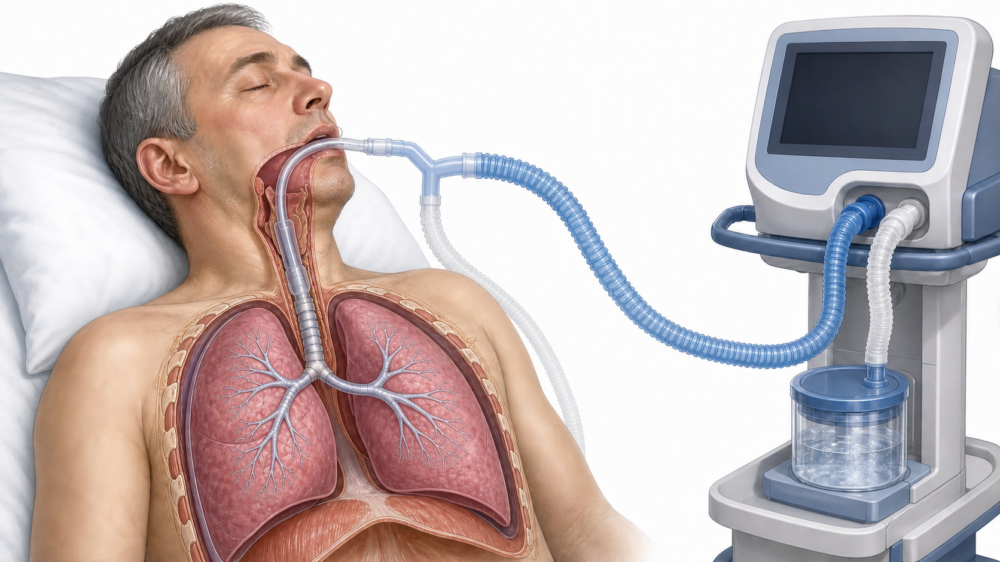
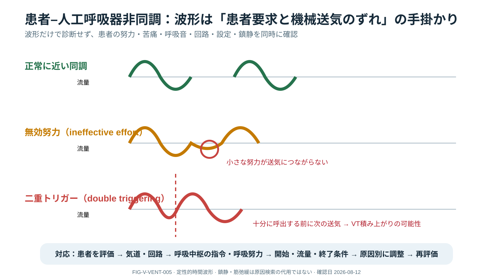

# 人工呼吸管理

> [!CAUTION]
> 設定は診断、呼吸器系力学、循環、患者努力、施設手順で個別化します。本頁は固定設定の処方箋ではありません。急変時は患者を先に評価して直ちに応援を要請し、人工呼吸器からの離脱や用手換気は、訓練を受けた医療者が酸素供給・バッグ・気道・圧損傷リスクを確認して施設手順に従います。

> [!TIP]
> 初めて図を見る場合やスマートフォンで読む場合は、[人工呼吸器の図解クイックガイド](VENTILATOR_VISUAL_QUICK_GUIDE.md)から始めてください。「一言でいうと」「最初に見る場所」「ミニ症例」の順で4枚を分割して説明しています。

> [!TIP]
> PEEP、Ppeak、Pplat、driving pressure、complianceなどの意味から確認したい場合は、[人工呼吸器の基本用語](VENTILATOR_TERMS.md)を先に読んでください。

## 0. Executive Summary — Quick Review

**[FACT] [CLM-VENT-001] 人工呼吸（mechanical ventilation）**は、患者、人工気道またはマスク、回路、人工呼吸器を一体として評価する生命維持治療です。AARCは患者―人工呼吸器評価を、身体所見、生理学的データ、気道、設定・実測値、加温加湿、記録を含む包括的評価と定義しています。[SRC-VENT-001]

**簡単に言うと：** 画面の設定を管理するのではなく、患者、人工気道、回路、人工呼吸器、病態を一体として評価し、supportの効果と害を繰り返し確認します。

| 用語 | 簡単な意味 | 最初に確認すること |
|---|---|---|
| mode | 人工呼吸器が呼吸をどう開始・制御・終了するかの方式 | 機種固有名だけでなくtrigger・target・cycle |
| setting | 医療者が設定した値 | 実測値と区別する |
| measured value | 患者と回路の結果として測定された値 | 呼気VT、minute ventilation、pressure、waveform |
| alarm | 設定範囲外や機器異常を知らせる警報 | silenceより先に患者を評価する |
| synchrony | 患者の呼吸要求と機械送気の一致 | 努力、苦痛、pressure/flow波形 |

**新人看護師の到達点：** 患者 → tube → 回路 → 設定 → 実測値 → 波形の順に確認し、alarm時の患者所見、変化、実施した確認、反応を報告すること。

**ベテラン向け深掘り：** 肺・横隔膜保護、患者努力、transpulmonary stress、右心・静脈還流、asynchrony、鎮静との相互作用を統合します。

### 報告例

> 「高圧alarmです。患者のSpO₂、血圧、呼吸努力は○○、tube深さと固定、左右換気は○○、回路は○○です。mode/設定は○○、Ppeak、Pplat、呼気VT、flow波形は○○で、吸引等への反応は○○です。」

## 1. 全体像 — Core

人工呼吸器はoxygenationとventilationを支え、呼吸仕事量を軽減する一方、VILI、循環抑制、横隔膜障害、鎮静関連害を生じ得ます。目標はgasを正常化することではなく、許容できるgas exchangeを最小限の害で確保し原因回復を待つことです。



**Illustration ILL-VENT-002 — 人工呼吸器から肺までの位置関係（概念図）**

- **最初に見る場所:** 右側の人工呼吸器から2本の回路脚をたどり、患者側の分岐、気管チューブ、気管、左右肺へ進みます。
- **Clinical Meaning:** 画面の数値は人工呼吸器単体ではなく、患者、人工気道、回路、肺・胸壁がつながった系から生じます。
- **重要な限界:** 生成AIを用いた概念イラストです。特定機種の正しい接続、加温加湿器の配置、回路交換、気管チューブ先端確認を教える手技図ではありません。実機構成は添付文書、臨床工学技士、施設手順で確認してください。
- **査読状態:** 二度の生成・目視修正を実施しましたが、呼吸療法・臨床工学・解剖の専門家確認前のため `REVISE / HUMAN REVIEW REQUIRED` です。

## 2. 基本となる力学

- **Equation of motion:** `Pvent + Pmus = (V/Crs) + (Flow × R) + PEEPtotal`
- **Pplat:** inspiratory hold中のno-flow pressure。条件が成立しているか確認
- **Driving pressure:** `Pplat − total PEEP`。静的complianceとの関係を示すが単独目標にしない
- **Compliance:** `VT / (Pplat − total PEEP)`
- **Resistance pressure:** peak–plateau差はconstant flow時の抵抗成分の手掛かり
- **Time constant:** `R × C`。呼気時間不足と高抵抗でair trapping/auto-PEEPが起きる

患者努力が強い場合、airway pressureだけではtranspulmonary stressを過小評価し得ます。

### Visual Series：気道内圧をmechanicsへ分ける


*Caption — 一定吸気流のvolume controlを想定し、Ppeak、Pplat、PEEPtotalを抵抗・弾性・呼気終末圧へ分けた教育用模式図。*

**Figure Interpretation**

- Ppeak−Pplatは、吸気流があるときに生じる抵抗成分の手掛かりです。
- Pplat−PEEPtotal（driving pressure）は呼吸器系の弾性負荷を反映しますが、患者努力、leak、hold条件が不適切なら誤読します。
- 設定PEEPとauto-PEEPを含むPEEPtotalを区別します。

**Clinical Meaning** — 数値だけを追わず、測定条件、患者努力、波形、診察を同時に確認します。


*Caption — 高いPpeakを、抵抗上昇とcompliance低下へ分けるための定性的比較。*

**Figure Interpretation** — 同じvolume・flow条件で、Ppeakのみが主に上がるなら抵抗上昇、PpeakとPplatがともに上がるならcompliance低下を考えます。

**Clinical Meaning** — 分泌物、気管支攣縮、tube屈曲、肺/胸壁病態などを仮説にし、患者と回路の評価で検証します。単一の圧差だけで診断を確定しません。

## 3. 換気モードと制御

Volume-targetedとpressure-targetedは「何を保証し、何が変動するか」が異なります。mode名は機種依存なので、trigger、target/control、cycle、backup、alarmを実機で確認します。FiO₂/PEEPはoxygenation、minute ventilationは主にPaCO₂、flow/rise/cycleはcomfortとsynchronyへ影響します。

## 4. ベッドサイド評価

1. 患者：胸郭、呼吸努力、意識、SpO₂、循環、ETCO₂
2. airway：tube depth、cuff、patency、secretions
3. circuit/device：接続、water、filter、valve、電源/gas
4. settings：mode、FiO₂、PEEP、VT/pressure、RR、flow、alarms
5. measured：exhaled VT/minute ventilation、Ppeak/Pplat/total PEEP、waveforms
6. cause and trend：病態、画像、gas、介入反応

## 5. 波形による臨床推論

- pressure rise/flow starvation、double triggering、ineffective effort、auto-trigger、premature/delayed cyclingを「患者要求と機械送気の不一致」として読む
- expiratory flowが次の吸気前にzeroへ戻らない所見はair trappingを示唆するが、測定条件とpatient effortを確認
- 高圧alarmは「tube obstruction/secretions/bronchospasm等のresistance」と「肺/胸壁compliance低下」をPpeak、Pplat、examで分ける
- 低圧/低volume alarmはdisconnection、leak、cuff、回路を考える

### Visual Series：時間波形を同じ呼吸で読む


*Caption — 一定吸気流のvolume controlと吸気pauseを例に、圧・流量・容量を同じ時間軸で並べた模式図。*

**Figure Interpretation** — pause中はflowが0となり、気道内圧はPpeakからPplatへ低下します。呼気ではflowが反対方向となり、volumeは基線へ戻ります。

**Clinical Meaning** — 波形形状はmode、設定、患者努力で変わるため、「正常形の暗記」ではなく各相の時間関係を読みます。


*Caption — 次の吸気前に呼気flowがzeroへ戻る例と、戻らない例を比較した教育用模式図。*

**Figure Interpretation** — 呼気flowが基線へ戻る前に次の吸気が始まる所見はair trappingを示唆します。呼気時間、抵抗、compliance、呼吸数、VT、患者努力を一緒に確認します。



*Caption — 正常に近い同調、ineffective effort（無効努力）、double triggering（二重トリガー）の定性的比較。*

**Figure Interpretation** — 小さな努力が送気につながらない場合と、十分な呼出前に次の送気が始まる場合を区別します。波形だけで確定せず、患者のdrive・努力、airway/回路、trigger、flow、cyclingを確認します。

**Clinical Meaning** — 鎮静・筋弛緩を先に強めるのではなく、痛み、不安、代謝性acidosis、呼吸仕事量、設定不一致などの原因を評価し、調整後の患者と波形を再評価します。

**Clinical Meaning** — 波形は発見の手掛かりです。定量には適切な呼気終末holdなどが必要で、外因性PEEPを反射的に増減せず原因へ介入して再評価します。

## 6. 臨床推論と対応

```text
アラーム/悪化 → 患者の換気・酸素化・循環を直接評価 → 応援要請
→ airway → circuit → ventilator → 病態の順に探索
→ 生命危機なら訓練・施設手順に沿った救命対応
→ 力学と波形から仮説 → 原因介入 → 全身状態と波形を再評価
```

肺保護はARDSだけでなくrisk患者でも意識し、PBWに基づくVT、過度なinspiratory pressure回避、適切なPEEP、過剰な自発努力とasynchronyの是正を統合します。鎮静・筋弛緩は原因探索を置き換えません。

## 7. ICU Nursing Pearls

- shift/移送/処置前後にtube位置、固定、cuff、設定、measured values、alarm、backupを確認
- alarm limitsを無効化せず患者に合わせる。alarm silence後に原因を残さない
- suctionは適応、preoxygenation、循環/SpO₂反応、分泌性状を評価し、routineな過剰介入を避ける
- oral care、head positioning、mobilization、communication、sleep、delirium preventionをbundle化
- ventilator変更後は血圧も確認。PEEP/mean airway pressure上昇はvenous return/RVへ影響し得る

## 8. Red Flags / Pitfalls

- manual ventilation困難、片側呼吸音、急な低血圧：tube obstruction/displacement、tension pneumothorax等
- Pplatをpatient effort/leak下で誤読、PBWでなく実体重を使用、auto-PEEPを外因性PEEPだけで解決
- waveform異常を鎮静不足だけと決めつける、正常ABGを得るため有害なpressure/volumeを許容

## 9. Take Home Messages

1. 患者、airway、circuit、ventilator、病態を順序立てて評価する。
2. 数値は測定条件とwaveformを確認して解釈する。
3. gas正常化ではなくlung/diaphragm protectionと回復を目指す。

## 10. Related Learning

- [人工呼吸器の基本用語](VENTILATOR_TERMS.md)
- [人工呼吸器の図解クイックガイド](VENTILATOR_VISUAL_QUICK_GUIDE.md)
- [ARDS](../ARDS/ARDS.md)
- [Ventilator Liberation](../Weaning/VENTILATOR_LIBERATION.md)
- [Respiratory Support Case](../../23_Clinical_Cases/CASE_RESPIRATORY_SUPPORT_ESCALATION.md)

## 11. Claim-level References

| Source ID | Title | Organization / Journal | Year / Status | Exact claim supported | Strength / certainty | Limits | DOI / PMID / Official URL | Verified on |
|---|---|---|---|---|---|---|---|---|
| SRC-VENT-001 | AARC Clinical Practice Guideline: Patient-Ventilator Assessment | AARC / Respiratory Care | 2024; current final | CLM-VENT-001：患者中心の包括的な患者―人工呼吸器評価 | Components have recommendation-specific grades | 病態別設定や急変時手技を一律に定めない | DOI: 10.4187/respcare.12007; PMID: 39048148; https://www.aarc.org/wp-content/uploads/2024/10/patient-ventilator-assessment-aarc-cpg.pdf | 2026-08-12 |
| SRC-VENT-002 | Mechanical Ventilation in Adult Patients with ARDS | ATS/ESICM/SCCM / AJRCCM | 2017; current recommendations retained where not updated | ARDSの低一回換気量・吸気圧制限 | strong; moderate certainty | 成人ARDSに限定 | DOI: 10.1164/rccm.201703-0548ST; PMID: 28459336; https://www.thoracic.org/statements/resources/cc/ards-guidelines.pdf | 2026-08-12 |
| SRC-VENT-003 | An Update on Management of Adult Patients with ARDS | ATS / AJRCCM | 2024; current final update | ARDSのPEEP、肺リクルートメント手技等 | recommendation-specific | 成人ARDSに限定 | DOI: 10.1164/rccm.202311-2011ST; PMID: 38032683; https://pubmed.ncbi.nlm.nih.gov/38032683/ | 2026-08-12 |
| SRC-VENT-004 | Lower Tidal Volumes versus Traditional Tidal Volumes for ALI/ARDS | ARDS Network / NEJM | 2000; landmark RCT | ARDS低一回換気量戦略の主要原著 | RCT | 現代のARDS定義以前。プロトコル全体として解釈 | DOI: 10.1056/NEJM200005043421801; PMID: 10793162 | 2026-08-12 |

## Review Log

| Date | Reviewer | Scope | Result |
|---|---|---|---|
| 2026-08-12 | Codex | safety wording / source status / AARC and ATS claim mapping | Major revision in progress; ventilator specialist review needed |
| 2026-08-12 | Codex | pressure mechanics / time waveforms / AARC CPG | Visuals and interpretation added; ventilator specialist review needed |
| 2026-08-11 | Codex | physiology / guideline identity / nursing | Source identity checked; claim-level mapping was incomplete |
