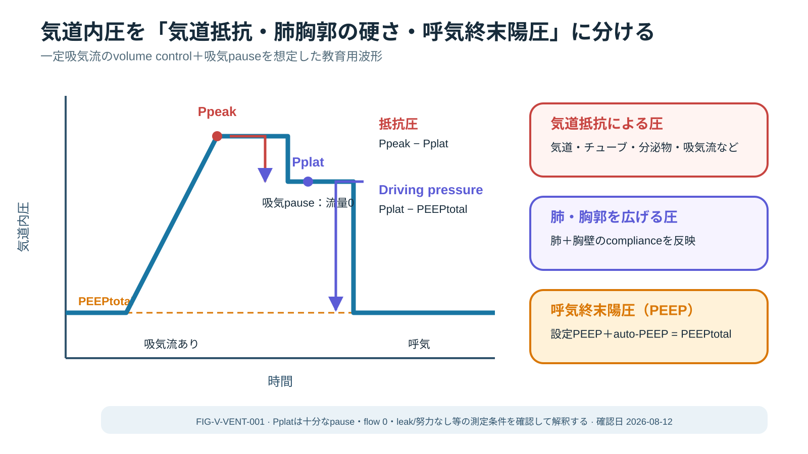
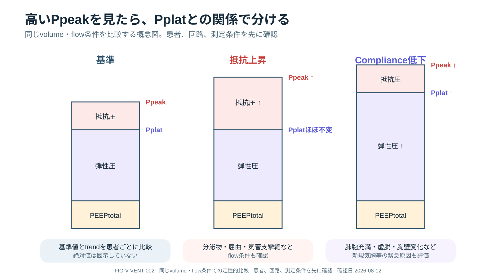
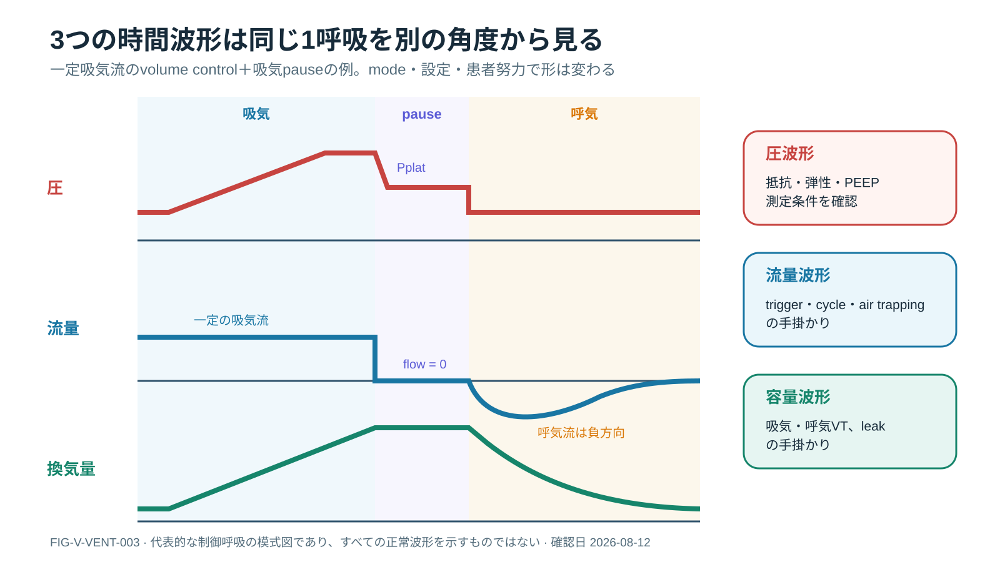
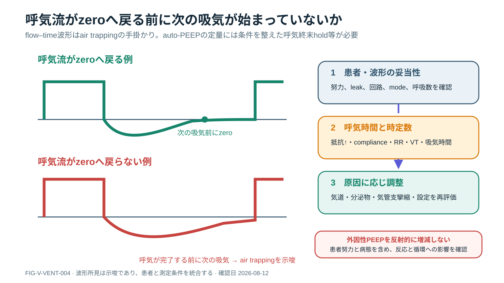

# 人工呼吸器の図解クイックガイド

> [!NOTE]
> 初めて図を見る人向けの入口です。スマートフォンでは1項目ずつ縦に読み、詳しい条件と安全上の注意は[人工呼吸管理の本文](MECHANICAL_VENTILATION.md)で確認してください。

## 1. 気道内圧は3つに分けて考える

**一言でいうと：** Ppeakという合計値を、抵抗・弾性・呼気終末圧へ分けます。

**最初に見る場所：** 左のPpeakからPplatへ下がる差、その後のPplatからPEEPtotalまでの差を順に見ます。

**ミニ症例：** 吸引後もPpeakが高い患者。吸気pauseでPplatを確認すると、Ppeakだけが高いのか、Pplatも高いのかで次の仮説が変わります。

**ここでは決められないこと：** 患者努力、leak、hold条件が不適切なら圧差を正しく解釈できません。

## 2. PpeakとPplatの組み合わせを見る

**一言でいうと：** Ppeakだけの上昇は抵抗、PpeakとPplatの同時上昇はcompliance低下の手掛かりです。

**最初に見る場所：** 中央の「抵抗上昇」と右の「compliance低下」で、Pplatの高さがどう違うかを比較します。

**ミニ症例：** 高圧alarmが鳴った患者。Ppeak上昇・Pplatほぼ不変なら分泌物、tube屈曲、気管支攣縮などを、両方上昇なら肺胞充満、虚脱、胸壁変化、気胸などを患者・回路・診察で検証します。

**ここでは決められないこと：** 図は同じvolume・flow条件での定性的比較です。単独所見で原因を確定しません。

## 3. 圧・流量・容量は同じ1呼吸で読む

**一言でいうと：** 3本の波形は別々の現象ではなく、同じ呼吸を違う角度から見ています。

**最初に見る場所：** 上から下へ同じ時点をたどり、吸気、pause、呼気で3本がどう変化するかを見ます。

**ミニ症例：** Pplatを測りたい患者。pause中にflowが0になっているかを確認し、その同じ時間帯のpressureを読みます。

**ここでは決められないこと：** 波形の形はmode、設定、患者努力で変わります。この図は一定吸気流のvolume controlの一例です。

## 4. 呼気flowが次の吸気前にzeroへ戻るかを見る

**一言でいうと：** 戻らない場合は、息を吐き切る前に次の吸気が始まるair trappingを疑います。

**最初に見る場所：** 左下の赤い呼気flowが、次の吸気が始まる縦線までに基線へ戻っているかを見ます。

**ミニ症例：** COPD患者で血圧低下と換気困難が出現。呼気flowがzeroへ戻っていなければ、患者・回路を確認し、呼気時間、抵抗、呼吸数、VTなどの原因候補を順に評価します。

**ここでは決められないこと：** 波形は手掛かりです。auto-PEEPの定量には条件を整えた呼気終末holdなどが必要で、外因性PEEPを反射的に変更しません。

## 4枚を見終えたら

1. 患者の状態と測定条件を先に確認する。
2. 圧を抵抗・弾性・PEEPへ分ける。
3. 圧・流量・容量を同じ時間軸で読む。
4. 仮説を患者、回路、診察、介入反応で検証する。

## Evidence

- Goodfellow LT, et al. AARC Clinical Practice Guideline: Patient-Ventilator Assessment. Respir Care. 2024;69:1042-1054. PMID: 39048148. [Official PDF](https://www.aarc.org/wp-content/uploads/2024/10/patient-ventilator-assessment-aarc-cpg.pdf).
- 医学的内容の正本：[Mechanical Ventilation](MECHANICAL_VENTILATION.md)

## Review Log

| Date | Reviewer | Scope | Result |
|---|---|---|---|
| 2026-08-12 | Codex | third-party comprehension / mobile reading / clinical caveats | Quick guide added; ventilator specialist and learner testing needed |
