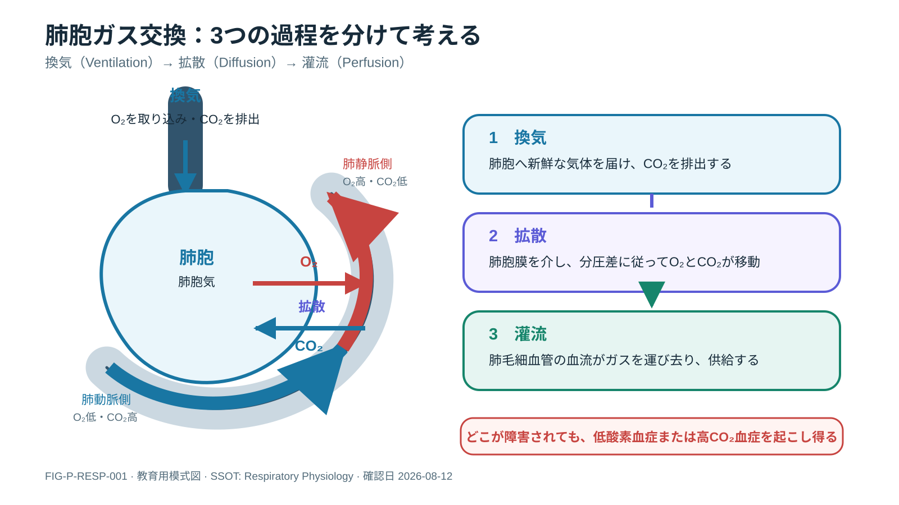
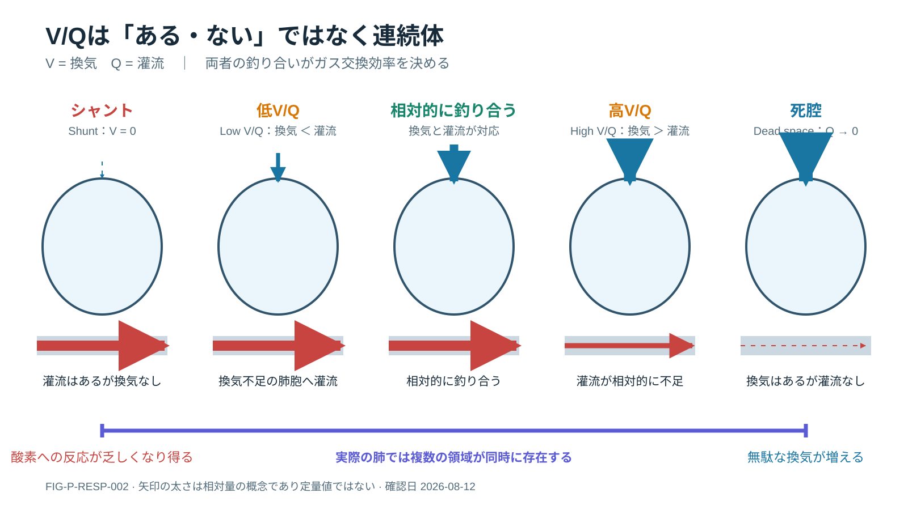
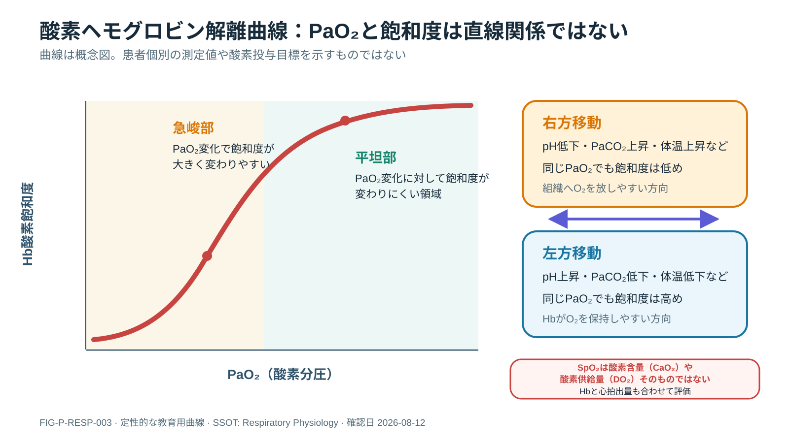

# Respiratory Physiology

> [!CAUTION]
> 教育目的の成人向け資料です。酸素投与、換気補助、人工呼吸器設定は患者の病態と施設protocolに基づき担当チームが判断してください。

## 1. Overview

呼吸の役割は「SpO₂を上げる」ことではなく、肺胞換気、肺胞―血液間gas exchange、血液による運搬、組織へのdelivery、CO₂排泄を維持することです。

## 2. Why It Matters

SpO₂低下、PaCO₂上昇、呼吸仕事量増加は別々のmechanismから起こります。oxygenation failureへ酸素だけ、ventilatory failureへ酸素だけで対応すると、病態進行や疲弊を見逃します。

## 3. Physiology

### Ventilation

- minute ventilation: `V̇E = tidal volume × respiratory rate`
- alveolar ventilation: `V̇A = (tidal volume − dead space) × respiratory rate`
- CO₂産生が一定ならPaCO₂はalveolar ventilationに反比例する

同じV̇Eでもrapid shallow breathingではdead-space fractionが増え、V̇Aが不足し得ます。

### Oxygen content and delivery

`CaO₂ ≈ 1.34 × Hb × SaO₂ + 0.003 × PaO₂`

`DO₂ = cardiac output × CaO₂`

PaO₂が高くてもHbまたはCOが低ければoxygen deliveryは不足し得ます。SpO₂はdeliveryを直接測っていません。

### Alveolar gas equation

`PAO₂ = FiO₂ × (PB − PH₂O) − PaCO₂ / R`

海面気圧、37℃、R≈0.8という仮定では、`PAO₂ ≈ FiO₂ × 713 − PaCO₂/0.8`。高度、FiO₂推定誤差、Rの変化でずれます。

### V/Q matching

- `V/Q = 0`: shunt（灌流はあるが換気なし）
- low V/Q: 換気不足の肺胞へ灌流
- high V/Q: 換気されるが灌流不足
- dead space: 灌流が極端に少ない換気

Gravity、lung volume、airway closure、血管障害により肺内V/Qは不均一です。

## Visual Series: Gas Exchange and V/Q



**Figure FIG-P-RESP-001 — 肺胞ガス交換。** 換気、肺胞膜を介する拡散、肺毛細血管の灌流を別々の過程として示す。見るべき点は、肺胞へ空気が届くだけでも、血流があるだけでも、効率的なガス交換は成立しないこと。

### Figure Interpretation

O₂は肺胞から血液へ、CO₂は血液から肺胞へ移動する。肺動脈側と肺静脈側のlabelは肺循環内の位置を表し、一般体循環の動静脈とは酸素化の関係が逆になる。

### Clinical Meaning

低酸素血症または高CO₂血症を見たら、換気、拡散、灌流のどこが障害されているかを分ける。図の矢印は方向を示す模式図で、ガス移動量を定量化していない。



**Figure FIG-P-RESP-002 — V/Q、shunt、dead space。** 換気と灌流の相対関係を5つの状態で比較する。矢印の太さは相対量の概念であり、実測値ではない。

### Figure Interpretation

shuntでは換気がなく灌流が残り、dead spaceでは換気があって灌流がほぼない。low/high V/Qはその中間にあり、実際の肺では異なるV/Q領域が同時に存在する。

### Clinical Meaning

「低酸素＝酸素不足」と一括せず、airway closure、肺胞充満、肺血管障害、過膨張などの機序へ戻る。酸素への反応だけで病態を断定せず、呼吸仕事量、PaCO₂、循環、画像を統合する。

## 4. Pathophysiology

### Hypoxemiaの主要mechanism

| Mechanism | A–a gradient | 酸素反応の概念 | 例 |
|---|---|---|---|
| 低FiO₂ | 正常域 | 反応 | 高地、供給error |
| alveolar hypoventilation | 正常域 | 反応 | CNS抑制、neuromuscular failure |
| V/Q mismatch | 拡大 | 多くは反応 | pneumonia、COPD、asthma |
| shunt | 拡大 | 反応不良になり得る | atelectasis、alveolar flooding |
| diffusion limitation | 拡大 | 多くは反応 | interstitial disease等 |

### Hypercapniaの主要mechanism

- V̇A低下：drive低下、muscle fatigue、胸郭/神経筋障害
- dead space増加：PE、肺血管床減少、過膨張
- CO₂産生増加に換気が追いつかない：発熱、seizure、overfeeding等
- ventilator/circuit問題：設定、leak、rebreathing、obstruction

## 5. Causes / Etiology

Hypoxemiaとhypercapniaを別々に整理し、気道、肺実質、胸膜、肺血管、胸郭、神経筋、中枢、機器へ分けます。複数mechanismは併存します。

## 6. Assessment

### 患者を最初に見る

- 発声、意識、体位、呼吸数・pattern・深さ
- accessory muscle、paradoxical breathing、silent chest
- 胸郭左右差、呼吸音、分泌物
- SpO₂値だけでなくpleth waveformとpulse一致
- oxygen device、FiO₂、接続、流量

## 7. Monitoring

- SpO₂ trendとsignal quality
- respiratory rate、work of breathing、意識
- ETCO₂ waveform/trend（PaCO₂と同一ではない）
- ABG/VBGを目的に応じ選択
- Hb、CO/perfusion、temperature
- ventilator pressure/flow/volume waveforms

FDAはpulse oximeterがpoor circulation、skin pigmentation、skin thickness/temperature、喫煙、nail polish等の影響を受け得ると注意しています。臨床所見と不一致なら測定部位・signalを確認し、必要に応じco-oximetry/ABGで確認します。

## 8. Interpretation

### SpO₂, SaO₂, PaO₂

- SpO₂: pulse oximeterによる推定
- SaO₂: arterial saturation。co-oximetry実測かblood gas計算値か確認
- PaO₂: plasmaに溶けたoxygen tension

Oxyhemoglobin dissociation curveはpH、temperature、PaCO₂、2,3-DPG等でshiftします。同じPaO₂でもSaO₂は一定ではありません。



**Figure FIG-P-RESP-003 — 酸素ヘモグロビン解離曲線。** PaO₂とHb酸素飽和度のS字関係、急峻部・平坦部、右方/左方移動を定性的に示す。患者固有の目標値を示す図ではない。

### Figure Interpretation

急峻部ではPaO₂の変化に伴い飽和度が大きく変わりやすく、平坦部では飽和度変化が小さい。pH、PaCO₂、体温などで曲線の位置が変わるため、同じPaO₂でも飽和度は一定ではない。

### Clinical Meaning

SpO₂が保たれていてもHb低下や心拍出量低下があれば酸素運搬は不足し得る。SpO₂、SaO₂、PaO₂、CaO₂、DO₂を同義語として扱わない。

### P/F ratio

`PaO₂ / FiO₂`はoxygenation impairmentの簡便指標ですが、PEEP、FiO₂、hemodynamics、sampling時点の影響を受けます。原因診断そのものではありません。

### A–a gradient

`A–a = PAO₂ − PaO₂`。hypoventilation/低FiO₂と肺内gas-exchange障害を考える補助ですが、年齢・FiO₂・気圧・計算仮定の影響があります。

### ETCO₂–PaCO₂ gap

ETCO₂は通常PaCO₂より低いことが多いものの、gapはdead space、CO、V/Q、samplingで変化します。固定換算しません。

## 9. Diagnosis

Gas valueだけで診断せず、患者、time course、device、imaging、hemodynamicsを統合します。ABGはoxygenation、ventilation、acid–baseのsnapshotです。

## 10. Clinical Reasoning

```text
SpO₂低下 / 呼吸状態悪化
→ 患者を見る・応援要請
→ Airwayは開通しているか
→ oxygen device / sensor / circuitは正しいか
→ ventilation failureか、oxygenation failureか、両方か
→ 胸郭・呼吸音・分泌物・waveform・ETCO₂
→ ABGと画像/POCUSを目的に応じ追加
→ low FiO₂ / hypoventilation / VQ / shunt / diffusion / dead space
→ 原因への介入
→ work of breathing・意識・gas・害を再評価
```

## 11. Treatment

Mechanismと原因に対応します。酸素化だけでなくairway patency、alveolar ventilation、recruitmentの可否、肺循環、Hb、COを評価します。oxygen targetやdevice選択の詳細は今後のSSOTへ分離します。

## 12. Nursing Points

- SpO₂ alarm時は患者→sensor→oxygen/device→呼吸評価
- oxygen変更前後のdevice、flow/FiO₂、SpO₂、RR、意識を記録
- cyanosisがないことやSpO₂が正常なことだけで換気不全を否定しない
- opioid/sedative後はRRだけでなく深さ、意識、ETCO₂を確認
- 採血時のFiO₂/PEEP/体位を記録し、比較可能にする

## 13. ICU Nursing Pearls

- 正常SpO₂でもhypercapniaは起こる
- 貧血ではSpO₂正常でもCaO₂が低い
- shock/低灌流ではpulse oximeter signal自体が不安定になり得る
- 数値と患者が合わないときは患者を信じ、測定系を疑い、別手段で確認する

## 14. Red Flags

- 意識低下、発声不能、silent chest
- exhaustion、paradoxical breathing、呼吸数低下への転換
- 酸素増量でも進行する低酸素
- ETCO₂ waveform消失/急変
- 片側呼吸音消失、急な気道内圧上昇
- severe acidemiaまたは急速なPaCO₂上昇

## 15. Troubleshooting

**Patient → Airway → oxygen source/device → Breathing → circuit/ventilator → measurement → ABG → cause → reassessment**。

## 16. Common Pitfalls

- SpO₂をoxygen deliveryと同一視
- oxygenationとventilationを混同
- ETCO₂からPaCO₂を固定換算
- P/F ratioだけで病名を決める
- normal SpO₂で呼吸疲弊を否定

## 17. Clinical Case

- [SpO₂突然低下とPaCO₂上昇](../../23_Clinical_Cases/CASE_DESATURATION_HYPERCAPNIA.md)

## 18. Clinical Questions

- [Respiratory Physiology / ABG Questions](../../24_Clinical_Questions/RESPIRATORY_PHYSIOLOGY_ABG_QUESTIONS.md)

## 19. Quiz

- [Respiratory Physiology / ABG Quiz](../../25_Quiz/QUIZ_RESPIRATORY_PHYSIOLOGY_ABG.md)

## 20. Take Home Messages

1. Oxygenation、ventilation、oxygen deliveryを分ける。
2. PaCO₂は主にalveolar ventilationを反映する。
3. Hypoxemia mechanismはA–a gradientと臨床像で整理する。
4. SpO₂にはmeasurement limitationがある。
5. 数値ではなく患者から始め、介入後に同じ指標で再評価する。

## 21. Slide Ready Summary

[20分教材](../../27_Slide_Ready/RESPIRATORY_PHYSIOLOGY_ABG_20MIN.md)

## 22. References

ABG検査とSpO₂精度の検証済みReferencesは[ABG References](../ABG/ABG_INTERPRETATION.md#22-references)を参照。

## Review Log

| Date | Reviewer | Scope | Result |
|---|---|---|---|
| 2026-08-12 | Codex | visual physiology / labels / directional accuracy | Three original SVGs added; respiratory expert review still needed |
| 2026-08-11 | Codex | physiology / evidence identity / nursing safety | Evidence reviewed; respiratory/clinical expert review needed |
