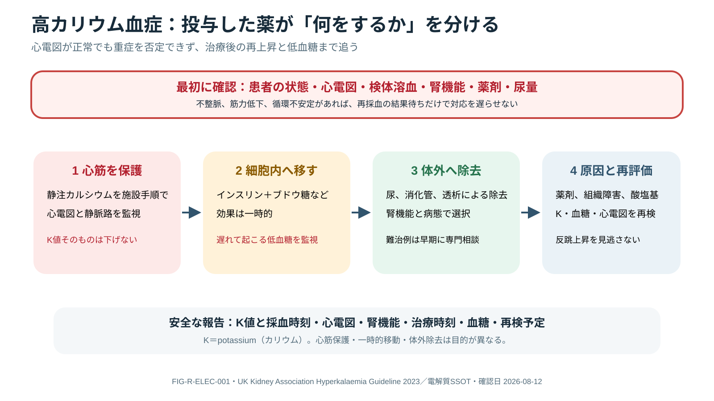

# Electrolyte Emergencies

> [!CAUTION]
> 急速なNa補正、重症K異常、IV calcium/K/Mg/Phosは致死的害を起こし得ます。症状、急性/慢性、ECG、腎機能、投与経路を確認し、施設の濃度・速度・再検protocolを使用してください。

## 0. まず覚える

電解質異常は数値の異常だけでなく、心筋・神経・筋・水分分布へ急速な害を生じます。

**簡単に言うと：** 検査値、症状、ECG、急性/慢性、腎機能、治療後の再検時刻を一組で管理します。

| 用語 | 意味 | 重要な注意 |
|---|---|---|
| hyperkalemia | 高K血症 | ECG正常でも重症を除外できない |
| membrane stabilization | 心筋膜安定化 | IV calciumはK値を下げない |
| intracellular shift | Kを一時的に細胞内へ移す | reboundと低血糖を監視 |
| osmotic demyelination | 急速なNa補正後の神経障害 | 慢性・高risk患者で補正速度を厳密管理 |

**新人看護師の到達点：** 検体溶血、ECG、症状、腎機能、投与route、再検時刻を確認し、治療を「投与して終了」にしないこと。

**ベテラン向け深掘り：** pH/glucose/albumin補正、redistribution、total body deficit/excess、ongoing loss、dialysis適応、過補正rescueを統合します。

## 1. General Approach

検体/溶血、単位、albumin/pH/glucose、renal/GI loss、drug、intake、shift、ECG、症状を確認します。値を一度正常化するのでなく、membrane stabilization、一時的shift、体外/腎からのremoval、原因治療、rebound監視を分けます。

## 2. Hyperkalemia



**Figure FIG-R-ELEC-001 — 高カリウム血症の目的別対応。** 心筋保護、カリウムの一時的な細胞内移動、体外除去、原因治療と再評価を分ける。静注カルシウムは心筋を保護するが、血清カリウム値を下げる治療ではない。図中のKはpotassium（カリウム）を表す。

UKKA 2023はrisk assessment→心筋保護→細胞内shift→K removal→K/glucose再検の構造化を推奨します。ECG正常でも重大hyperkalemiaを除外できません。

- ECG変化/不安定時のIV calciumは膜安定化でありKを下げない
- insulin–glucose等は一時的shiftで、hypoglycemia監視が必須
- β₂ agonist等は補助。薬剤/病態で反応が異なる
- binder、diuretic、dialysis等で体外除去。refractory/AKIでは早期KRT相談
- pseudohyperkalemiaを考えるが、危険な所見があれば確認待ちで治療を遅らせない

## 3. Hyponatremia

まずeffective osmolality、glucose補正、volume context、urine osmolality/Na、acute/chronic、神経症状を評価します。severe symptomsではhypertonic salineをprotocolで用い、症状改善と過補正回避を両立します。慢性/高risk（低K、栄養不良、アルコール、肝疾患等）ではosmotic demyelination riskが高く、frequent Na/urine monitoringとovercorrection rescue planを要します。

## 4. Other Electrolytes

- hypokalemia：Mg deficiency、GI/renal loss、insulin/alkalosis、arrhythmiaを評価
- Mg：torsades/seizure/arrhythmiaとrenal clearanceを考慮
- phosphate：refeeding、respiratory alkalosis、weakness/hemolysis、replacement harm
- calcium：ionized Ca、pH、citrate、massive transfusion、pancreatitis、drug

## 5. Clinical Reasoning

```text
critical value → patient/ECG + sample validity → immediate threat stabilization
→ total body gain/loss vs shift → cause and renal capacity
→ correction plan with ceiling/target → timed recheck
→ rebound/overcorrection/secondary electrolyteを監視
```

## 6. Nursing Points

- high-alert replacementはconcentration、route、pump、line compatibilityをdouble-check
- K治療後のglucoseをprotocol時刻で追跡し、遅発hypoglycemiaを見逃さない
- Na correctionは採血時刻、fluid/urine、medicationを同じtimelineへ記録
- telemetry、IV site、pain、extravasation、renal functionを監視
- nutrition開始時はK/Mg/Phosとfluidをrefeeding riskで確認

## 7. Red Flags / Pitfalls

- arrhythmia、weakness/paralysis、seizure、coma、急なNa変化
- calcium投与でK治療完了、insulin後glucose未監視、Naを日単位だけで追う
- total Caだけ、Mg未補正のrefractory hypokalemia、rebound未評価

## 8. Take Home Messages

1. ECG/症状、sample、急性度を値と同時評価する。
2. stabilization・shift・removal・causeを分ける。
3. 再検時刻と補正上限を治療前に決める。

## 9. References

- UK Kidney Association. Clinical Practice Guideline: Management of Hyperkalaemia in Adults. 2023. https://www.ukkidney.org/health-professionals/guidelines/treatment-acute-hyperkalaemia-adults-0
- Spasovski G, et al. Clinical practice guideline on diagnosis and treatment of hyponatraemia. Eur J Endocrinol. 2014. DOI: 10.1530/EJE-13-1020; PMID: 24569125.

## Review Log

| Date | Reviewer | Scope | Result |
|---|---|---|---|
| 2026-08-12 | Codex | V2 terminology / medication safety / repeat testing | Staged-learning introduction added; nephrology/pharmacy review needed |
| 2026-08-11 | Codex | electrolyte guideline / safety / nursing | Evidence reviewed; nephrology/pharmacy/local protocol review needed |
