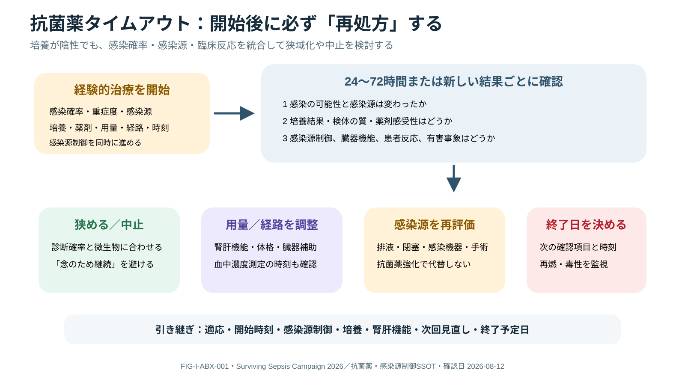

# Antimicrobial Therapy and Source Control

> [!CAUTION]
> empiric regimen・dose・durationは感染源、重症度、臓器機能、体格、allergy、local antibiogram、過去培養、ECMO/CRRT等で異なります。本頁は固定処方表ではありません。医師・薬剤師・感染症/外科チームで個別化してください。

## 0. まず覚える

**経験的抗菌薬治療（empiric therapy）**は病原体確定前に確率に基づき開始する治療、**感染源制御（source control）**は膿瘍drainage、感染device抜去、手術等で感染の持続原因を除くことです。

**簡単に言うと：** 抗菌薬を早く入れるだけでなく、適切な薬・量・経路・時刻と感染源処置をそろえ、結果が出たら狭める・止める判断をします。

| 用語 | 意味 | 看護で見ること |
|---|---|---|
| antibiogram | 施設・地域の薬剤感受性集計 | empiric選択の背景。個人培養を優先する場合あり |
| PK/PD | 薬物動態/薬力学 | 腎肝機能、体格、CRRT/ECMO、投与時間 |
| de-escalation | 結果に応じcoverageを狭めること | 培養、臨床反応、診断確率、duration review |
| source control | 感染源の除去・制御 | consultation、実施時刻、drain、検体、反応 |

**新人看護師の到達点：** allergyの具体像、培養採取、薬剤・dose・route・開始時刻、腎機能、line、source control予定と反応を確認すること。

**ベテラン向け深掘り：** SSC 2026の感染確率別timing、PK/PD変化、MDR risk、therapeutic drug monitoring、診断撤回、短期化を統合します。

## 1. Overview

適正治療はright drug–dose–route–time–source control–duration–reviewです。初期に十分なcoverageが必要な患者と、不要なbroad therapyの害を避ける患者を、緊急度と感染確率で分けます。

## 2. Empiric Therapy

- likely source/pathogens、severity/shock、immune status
- prior organisms/MDR risk、recent antibiotic、healthcare exposure、local susceptibility
- true allergy phenotype、pregnancy、renal/hepatic function、weight
- tissue penetration、loading dose、PK/PD、augmented renal clearance
- CRRT/ECMO、fluid expansion、hypoalbuminemiaによるdistribution/clearance

SSC 2026のtime recommendationはshock/likelihoodに応じて読み、全ての“possible sepsis”へ同じ1時間ruleを機械適用しません。ただしseptic shock/高probabilityでは迅速な適切治療を優先します。

## 3. Source Control

drainage、debridement、device removal/exchange、obstruction relief、surgeryなど、感染focusと継続汚染を除きます。

- sourceは何か、control可能か、最小侵襲で確実な方法は何か
- imaging/transport/anesthesia/bleeding riskと遅延害を比較
- procedureで適切なculture/tissueを得る
- “抗菌薬を強くする”ことでundrained sourceを代替しない
- control後も残存focus、drain function、complicationを再評価

## 4. Diagnostic / Antibiotic Timeout



**Figure FIG-I-ABX-001 — 抗菌薬タイムアウト。** 経験的抗菌薬を開始した後、新しい結果ごとに感染確率、培養、感染源制御、臓器機能、反応と害を再評価し、狭域化、中止、用量・経路、終了日を再決定する。培養陰性だけで感染を否定せず、培養陰性だけを理由に広域薬を漫然と継続もしない。

24–72時間または新しい結果ごとに：

1. infection probability/sourceは変わったか
2. organism/susceptibilityとspecimen qualityは
3. clinical response/source controlは十分か
4. narrow、stop、route change、dose/TDM adjustmentは可能か
5. duration/end dateとfollow-up testは

SSC 2026はfinal cultureでpathogenが同定されなくてもde-escalationを提案し、adequate source control後にduration不明ならPCTと臨床評価を併用した中止判断を提案します。PCT単独のautomatic stopではありません。

## 5. Clinical Reasoning

```text
infection probability × severity → empiric threshold/coverage
→ source controlを並行 → PK/PDとorgan supportでdose設計
→ patient response + cultures + source status
→ narrow/stop/adjust + end date → relapse/toxicity/resistance監視
```

## 6. Nursing Points

- first-dose時刻、採取との順序、line compatibility、infusion durationを記録
- allergy reaction、renal/hepatic、cytopenia、QT、neurotoxicity、C. difficile等を監視
- TDM sampleはdose/infusion/採血時刻を正確に揃える
- source-control drainの量/性状/patency、wound/lineを観察
- antibiotic indicationとreview/end dateをhandoffし“なんとなく継続”を防ぐ

## 7. Red Flags / Pitfalls

- necrotizing focus、obstruction、abscess、infected device、persistent bacteremia/fungemia
- culture陰性でbroadeningのみ、renal recovery/CRRT変更後のdose未調整
- prolonged broad combination、source control delay、stop dateなし

## 8. Take Home Messages

1. empiric coverageはprobability、severity、MDR riskで設計する。
2. source controlは抗菌薬と並ぶ治療の柱。
3. timeoutでnarrow/stop/dose/durationを必ず再処方する。

## 9. References

- Prescott HC, et al. Surviving Sepsis Campaign 2026. DOI: 10.1007/s00134-026-08361-1; PMID: 41870560.
- Barlam TF, et al. IDSA/SHEA Antibiotic Stewardship Guideline. Clin Infect Dis. 2016. DOI: 10.1093/cid/ciw118; PMID: 27080992.
- CDC. Core Elements of Hospital Antibiotic Stewardship Programs. Updated framework 2019; implementation page reviewed 2026-08-11. https://www.cdc.gov/antibiotic-use/hcp/core-elements/hospital.html

## Review Log

| Date | Reviewer | Scope | Result |
|---|---|---|---|
| 2026-08-12 | Codex | V2 terminology / SSC 2026 / antimicrobial safety | Staged-learning introduction added; ID/pharmacy/surgery review needed |
| 2026-08-11 | Codex | SSC/stewardship/source control / nursing | Evidence reviewed; ID/pharmacy/surgery/local antibiogram review needed |
