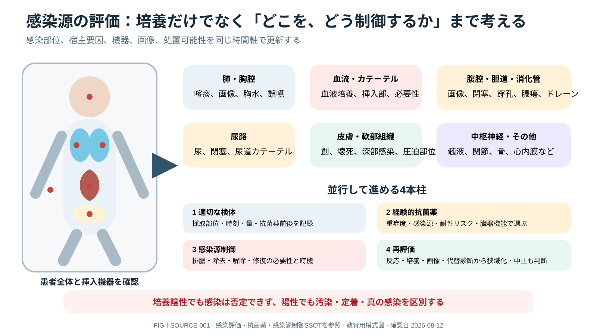

# Infection Assessment in the Critically Ill



> [!NOTE]
> 感染部位の候補を全身と挿入機器から確認し、検体採取、抗菌薬、感染源制御、再評価を並行する図です。培養陽性だけで真の感染と判断せず、陰性だけで感染を否定しません。

> [!CAUTION]
> 感染疑いとsepsisは同義ではなく、sepsis mimicも多くあります。一方、shock/高probability感染で検査完了を待って治療を遅らせないでください。診断確率と緊急度を明示します。

## 0. まず覚える

**感染評価**は、宿主risk、症候群、解剖学的感染源、病原体、臓器障害、代替診断を繰り返し更新するprocessです。

**簡単に言うと：** 発熱やCRPだけで感染と決めず、「どこに、何が、どの確率で、どれほど緊急か」を考えます。

感染源制御（source control）は、膿瘍の排膿、感染機器の除去、閉塞の解除、穿孔の修復など、感染が続く原因を物理的に減らす対応です。抗菌薬だけでは制御できない感染源があるため、処置可能性と時機を早期に評価します。

| 用語 | 意味 | 注意 |
|---|---|---|
| colonization | 病原体が存在するが感染を起こしていない状態 | 培養陽性だけで治療しない |
| contamination | 採取過程等で混入した微生物 | 採取法、set、菌種、臨床像を確認 |
| diagnostic stewardship | 適切な患者・検体・時点で検査する考え方 | 不適切検体は過剰治療を生む |
| sepsis mimic | sepsisに似た非感染性病態 | 出血、PE、薬剤、内分泌等を並行評価 |

**新人看護師の到達点：** device、創、皮膚、呼吸、尿、腹部、意識を系統的に見て、検体の種類・採取法・時刻・抗菌薬前後を記録すること。

**ベテラン向け深掘り：** pretest probability、host phenotype、MDR risk、検体quality、colonization、source control、治療反応とalternative diagnosisを統合します。

## 1. Overview

感染評価は「発熱＋炎症反応」ではなく、host risk、syndrome、anatomic source、pathogen/MDR risk、organ dysfunction、alternative diagnosisを更新するBayesian processです。immunocompromised患者では発熱/白血球反応が乏しいことがあります。

## 2. Initial Assessment

- onset、community/healthcare exposure、recent antibiotic/culture/colonization、travel/animal/procedure
- device、wound、skin、oral/sinus、lung、urinary、abdomen/pelvis、CNS、joint/spine
- organ dysfunction、shock/perfusion、lactate、airway/oxygenation
- immune status、anatomy、renal/hepatic function、allergy historyの質
- infection mimic：hemorrhage、PE、pancreatitis、drug fever、transfusion reaction、withdrawal、endocrine、malignancy等

## 3. Cultures and Specimens

抗菌薬前の適切な培養を目指しますが、septic shock等でmeaningful delayを作りません。

- blood cultureは適切なvolume、複数set、別site/line indication、skin antisepsis、label/time
- urineはsymptom/device/pyuria/collection methodを文脈化。colonization/asymptomatic bacteriuriaを感染と短絡しない
- respiratory sampleはquality、upper-airway contamination、ventilator contextを評価
- sterile-site fluid/tissueはsource control時に優先。swabより適切な深部sampleを検討
- positive resultはpathogen vs contaminant/colonizer、time to positivity、複数set、臨床像で解釈

## 4. Biomarkers and Imaging

WBC/CRP/PCT/lactateは単独で感染の有無や抗菌薬開始を決めません。serial responseや中止支援の一部として用います。画像はsource/complicationとdrainabilityを問うために選び、必要なcontrast/transport riskと比較します。

## 5. Clinical Reasoning

```text
possible infection → stability/organ dysfunction → source syndrome + host/MDR risk
→ cultures/specimens without harmful delay → imaging/source-control question
→ empiric treatment threshold → 24–72hでmicrobiology/response/mimicを再統合
→ confirmed / probable / unlikely を更新
```

## 6. Nursing Points

- antibiotic前/後、culture採取部位・volume・時刻、temperature methodを記録
- line cultureはlumen、末梢とのpair、discard/採取法を施設手順で統一
- device necessity、wound/drain/secretions、skin、oral、stool、urineの変化をsystematicに観察
- isolation/PPEを病原体riskに応じ開始し、検査結果で更新
- “culture negative”を感染なしとも、継続必須とも決めず臨床反応を共有

## 7. Red Flags / Pitfalls

- shock、purpura、meningism、necrotizing infection、rapidly progressive pain/swelling、device infection
- low-quality specimenの培養結果を治療、colonizationをinfection化、培養のため抗菌薬遅延
- sepsis label後にmimic再評価なし、PCT単独で開始判断

## 8. Take Home Messages

1. source、host、pathogen、organ dysfunction、mimicを同時に考える。
2. specimen qualityは結果の価値を決める。
3. 診断確率を時間とデータで明示的に更新する。

## 9. References

- Prescott HC, et al. Surviving Sepsis Campaign 2026. DOI: 10.1007/s00134-026-08361-1; PMID: 41870560.

## Review Log

| Date | Reviewer | Scope | Result |
|---|---|---|---|
| 2026-08-12 | Codex | V2 terminology / diagnostic stewardship / specimen quality | Staged-learning introduction added; ID/microbiology review needed |
| 2026-08-11 | Codex | diagnostic strategy / specimen / nursing | Evidence reviewed; ID/microbiology/local lab review needed |
