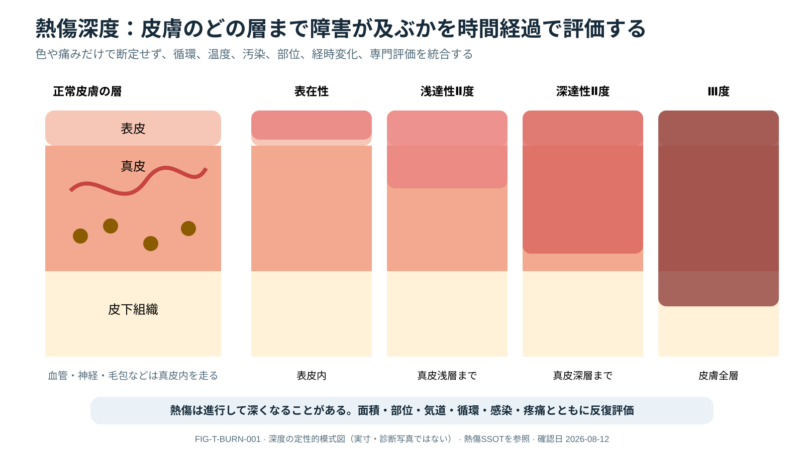

# Burn Initial Management

> [!NOTE]
> 表皮、真皮、皮下組織と熱傷の到達深度を比較します。深度は受傷直後の外観だけで固定せず、循環、冷却、感染、部位、時間経過を含めて反復評価します。

## 0. まず覚える

熱傷初期管理では、創面だけでなく、**気道、呼吸、循環、低体温、併存外傷を先に守る**。見た目が軽くても、吸入損傷や全周性熱傷は時間とともに悪化しうる。

**簡単に言うと：** 燃焼を止め、`<C>ABCDE`で生命危機を処置し、熱傷範囲と深さを見積もり、保温しながら専門施設へ早期相談する。

浅達性Ⅱ度熱傷は主に真皮浅層まで、深達性Ⅱ度熱傷は真皮深層まで、Ⅲ度熱傷は皮膚全層へ及ぶ概念です。実際の創は均一とは限らず、同じ部位に異なる深度が混在します。

| 用語 | 意味 | 実践上のポイント |
|---|---|---|
| TBSA | total body surface area、熱傷した体表面積の割合 | 輸液計算では通常、浅達性II度以上を数え、発赤のみは含めない |
| burn depth | 熱が皮膚のどの深さまで傷害したか | 初期所見だけで固定せず、時間経過で再評価する |
| inhalation injury | 煙、熱、化学物質による気道・肺の損傷 | 通常のSpO₂だけでは一酸化炭素曝露を除外できない |
| eschar | 深い熱傷で生じる硬い壊死組織 | 全周性では胸郭運動や末梢循環を妨げることがある |
| burn shock | 大面積熱傷後の血管透過性亢進などによる循環不全 | 輸液式は開始量の目安であり、反応を見て調整する |
| fluid creep | 必要量を超えて輸液量が増え続けること | 浮腫、肺障害、腹部/四肢compartment syndromeにつながる |

**新人看護師の到達点：** 受傷時刻と機転、閉鎖空間曝露、声・呼吸の変化、TBSA根拠、輸液量、尿量、体温、創部・末梢循環を記録し、濡れた被覆の放置や氷による冷却を避けられる。

> **報告例：** 「閉鎖空間火災で顔面熱傷があります。嗄声と頸部浮腫が進行し、SpO₂は保たれていますが吸入損傷を否定できません。困難気道化する前の評価とburn centerへの相談をお願いします。」

**ベテラン向け深掘り：** Parklandなどの式を自動投与量とせず、尿量だけでなく灌流、lactate、呼吸、腹圧、心腎機能、累積balanceでtitrateする。小児、妊娠、電撃、化学熱傷、外傷併存では標準式から外れる理由を明確にする。

## First actions

燃焼過程を止め、医療者/患者の安全を確保し、`<C>ABCDE`で併存外傷を評価する。衣服・装飾品を外し、短時間の適切な冷却後は濡れたままにせず保温する。氷や長時間の冷却で低体温を作らない。

## Airway and inhalation injury

閉鎖空間、顔面/頸部熱傷、煤、嗄声、stridor、咳、意識障害、爆発機転を確認する。浮腫進行で後の気道確保が困難になる可能性と、不必要な挿管の害を比較し、早期に熟練者・burn centerへ相談する。

通常のSpO₂はcarbon monoxide曝露を除外しない。機転に応じco-oximetry、血液ガス/lactate、ECG等を用い、cyanide等は地域protocol/専門家判断で扱う。

## Estimate extent and depth

- 成人はRule of Nines、散在/小範囲は患者手掌（指を含む約1%の目安）、小児は年齢補正法を使う。
- TBSA fluid計算には通常partial/full-thicknessを含め、superficial erythemaは含めない。
- 深さは時間で変化するため再評価する。顔面、手、足、会陰、生殖器、大関節、circumferential burn、電撃/化学熱傷は小範囲でも高risk。

## Fluid resuscitation as a titrated process

成人の大面積熱傷（ABA guidelineは20% TBSA以上を対象）では、受傷時刻からのprotocol-based crystalloidを開始し、体重・TBSAによる式は**開始点**にする。尿量、灌流、意識、lactate/base deficit、呼吸/腹圧、累積balanceを用いて調整し、“formula creep”を避ける。

> [!CAUTION]
> 尿量だけを追って輸液を増やし続けない。catheter閉塞、腎障害、腹部/四肢compartment syndrome、心機能、併存出血を再評価する。小児・電撃・妊娠・心腎疾患は専門protocolが必要。

## Wound and limb safety

- 清潔な被覆、鎮痛、tetanus、汚染除去を行う。routine systemic prophylactic antibioticsを自動的に開始しない。
- circumferential chest/limb burnでは換気、末梢灌流、痛み、緊満、Dopplerをserial評価し、escharotomy等をburn specialistへ即時相談。
- 化学熱傷は乾燥粉末の除去と十分な灌流を基本に、物質固有情報/poison centerを確認。電撃では不整脈、深部組織障害、compartment syndromeを評価する。

## Burn-center consultation / transfer

範囲・深さだけでなく、部位、吸入/化学/電撃、併存外傷、comorbidity、疼痛管理、地域資源で早期相談する。転送前に気道・access・保温・鎮痛・fluid開始時刻・TBSA根拠・画像/検査を共有する。

## Nursing surveillance and red flags

- 受傷時刻、fluidの種類/速度/累積量、尿量、温度、体重、TBSA chart、創部写真（同意/規定内）を一貫して記録。
- **即時escalation:** 声/呼吸変化、進行する顔頸部浮腫、換気圧上昇、末梢pulse/Doppler低下、激痛/緊満、乏尿、腹部膨満、低体温、意識/乳酸悪化。

## Take-home messages

1. burnでも最初はABCDEと併存外傷評価。
2. TBSAとfluid formulaは推定の出発点で、serial physiologyで補正する。
3. inhalation injuryとcircumferential burnは見た目以上に時間依存性。
4. 早いburn-center consultationが転送前の安全性を上げる。

## References

1. Cartotto R, et al. American Burn Association Clinical Practice Guidelines on Burn Shock Resuscitation. J Burn Care Res. 2024;45:565-589. DOI: `10.1093/jbcr/irad125`; PMID: `38051821`.
2. American Burn Association. Burn Shock Resuscitation Clinical Practice Guideline. 上記journal article（DOI/PMID）を一次参照とする（旧guideline一覧URLは2026-08-12にリンク切れを確認したため削除）。

## Review log

- 2026-08-12: V2導入、TBSA/吸入損傷等の用語、新人観察、fluid creepを含む高度判断を追加。ABA 2024 guidelineを再確認。
- 2026-08-11: Initial evidence review; burn center and local transfer-protocol review required.
