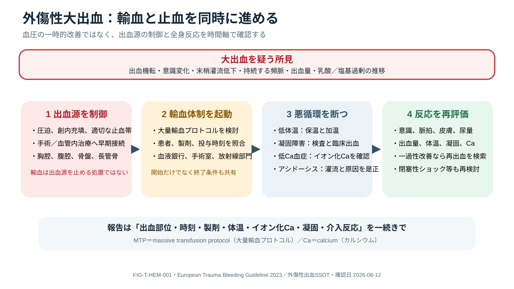

# Traumatic Hemorrhage and Damage Control

## 0. まず覚える

外傷性大出血では、血圧を一時的に上げることだけが蘇生ではない。**出血源を止めながら、酸素を運ぶ血液と止血機能を保ち、低体温などの悪循環を断つ**ことがdamage-control resuscitation（ダメージコントロール蘇生）である。

**簡単に言うと：** 「血を入れる」と「血を止める」を同時に進め、数値が良くなっても出血源が未制御なら安心しない。

| 用語 | 意味 | 実践上のポイント |
|---|---|---|
| hemorrhagic shock | 出血により循環血液量と酸素運搬が不足したshock | 初期Hbや血圧が正常でも否定できない |
| source control / definitive hemostasis | 手術、IVR、圧迫などで出血源を実際に止めること | 輸血は止血そのものではない |
| MTP | massive transfusion protocol、大量輸血protocol | 血液製剤、検査、加温、人員を迅速に連動させる施設手順 |
| coagulopathy | 血液が適切に固まりにくい状態 | 希釈、低体温、acidosis、消費など複数要因で悪化する |
| lethal diamond | 低体温、acidosis、coagulopathy、低Ca血症の悪循環 | 4項目を別々でなく同時に監視・是正する |
| permissive hypotension | 止血前に過度な血圧上昇を避ける戦略 | TBI、妊娠、脊髄虚血などでは一律適用しない |

**新人看護師の到達点：** 出血部位、vital/意識/末梢灌流、製剤名と投与時刻、体温、ionized Ca、検査推移、尿量を一つのtimelineで追い、MTP機器・加温・line・患者/製剤照合を安全に実施できる。

> **報告例：** 「骨盤損傷疑いでMTP開始後、赤血球製剤4単位投与中ですが、MAP低下、体温35.2℃、ionized Ca低下、乳酸上昇が続いています。出血源未制御とlethal diamond進行を疑い、手術/IVRへの移行と補正方針の再評価をお願いします。」

**ベテラン向け深掘り：** 一過性の血圧反応を止血成功と誤認せず、閉塞性shockやTBI併存、抗凝固薬、妊娠、製剤供給制約を含めて戦略を更新する。MTPの開始基準だけでなく、解除、過剰蘇生、血栓症、ARDS、輸血反応までexit planとして扱う。

## Clinical priority

出血性shockでは、輸液で数値を一時改善することより**出血を止め、酸素運搬を保ち、低体温・acidosis・coagulopathy・hypocalcemiaの悪循環を断つ**ことが中心となる。

> [!CAUTION]
> 固定した製剤比、TXA投与法、fibrinogen/calcium閾値を処方しない。施設massive transfusion protocol（MTP）、検査法、血液製剤在庫、専門科判断に従う。

## Recognize hemorrhagic shock

低血圧は遅い所見になりうる。機転、頻脈/脈圧、末梢灌流、意識、呼吸、serial Hb、base deficit/lactate、POCUS、出血量と反応を統合する。初期Hb正常は急性出血を否定しない。

主なhidden compartmentsは胸腔、腹腔/後腹膜、骨盤、長管骨。抗凝固薬/抗血小板薬、妊娠、高齢、低体温を早期に把握する。

## Parallel damage-control bundle



**Figure FIG-T-HEM-001 — 外傷性大出血の並行行動。** 出血源制御、大量輸血体制、低体温・凝固障害・低カルシウム血症・アシドーシスへの対応、反応の再評価を直列ではなく同時に進める。図中のMTPはmassive transfusion protocol（大量輸血プロトコル）、Caはcalcium（カルシウム）を表す。固定した製剤比や投与量を示す図ではない。

1. **Control:** direct pressure、wound packing、適切なtourniquet、骨盤輪損傷が疑わしい場合のbinder、迅速な手術/IVR/転送。
2. **Activate:** ongoing major hemorrhageが疑われればMTPを早期起動し、血液銀行・手術・麻酔・IVRへ共通mental modelを伝える。
3. **Resuscitate:** crystalloid過剰を避け、施設protocolに基づき血液製剤を提供。出血制御までの血圧目標はTBI、妊娠、脊髄虚血等で異なる。
4. **Preserve hemostasis:** active warming、ionized calcium、fibrinogen、platelet、PT/aPTTまたはviscoelastic testing、pHをserialに確認。
5. **Antifibrinolytic:** 適応があれば受傷時刻を確認し、早期にlocal protocolでTXAを検討する。遅延投与や禁忌を機械的に無視しない。
6. **Reassess:** responseを一過性/不十分/持続に分け、出血源未制御、line/device、閉塞性shock、TBI併存を再検索する。

## Damage-control reasoning

```text
Suspected major bleeding
  ├─ compressible → pressure / packing / tourniquet
  └─ non-compressible → OR / IR / transfer pathway now
         + MTP + warming + calcium/coagulation monitoring
                       ↓
             definitive hemostasis achieved?
                no: find ongoing/second source
               yes: physiology-guided normalization and de-resuscitation
```

## Anatomic pitfalls

- pelvic binderは大転子レベルに装着し、皮膚/末梢循環を監視。長時間放置せずdefinitive planへ接続する。
- eFAST陰性は骨盤/後腹膜/腸管損傷を除外しない。腹膜刺激、ongoing shock、汚染は外科的source controlを急ぐ。
- 胸腔減圧/drain後も排液量と速度、air leak、反応を追う。突然の悪化はtube occlusion/dislodgementも確認する。

## Stop points and transition

MTPは「開始」だけでなく解除条件を共有する。出血制御後は製剤投与を盲目的に継続せず、検査、温度、灌流、臓器機能に応じて補正し、fluid overload、ARDS、thrombosis、輸血反応を監視する。

## Nursing safety

- patient/product identification、warmer、rapid infuser、line patency、製剤/薬剤/時刻、推定出血、drain、体温を記録。
- citrate関連hypocalcemia、hyperkalemia、低体温、輸血反応、air embolism/line disruptionを監視。
- tourniquet解除、binder移動、移送、体位変換は出血再燃の危険をteamで共有する。

## Take-home messages

1. hemorrhage controlはresuscitationと同時、しばしばそれ以上に時間依存性。
2. lethal diamondをserial dataで追い、固定比や単一検査だけに依存しない。
3. permissive hypotensionは一律ではなく、TBI等の併存で害になりうる。
4. MTP解除と出血制御後の再評価までがprotocol。

## References

1. Rossaint R, et al. European guideline on management of major bleeding and coagulopathy following trauma: sixth edition. Crit Care. 2023;27:80. DOI: `10.1186/s13054-023-04327-7`; PMID: `36859355`.
2. American College of Surgeons. Trauma Quality Programs Best Practices Guidelines: Massive Transfusion. https://www.facs.org/quality-programs/trauma/quality/best-practices-guidelines/ (verified 2026-08-11)
3. Coccolini F, et al. Pelvic trauma: WSES classification and guidelines. World J Emerg Surg. 2017;12:5. DOI: `10.1186/s13017-017-0117-6`; PMID: `28115984`.

## Review log

- 2026-08-12: V2導入、MTP/lethal diamond等の用語、新人のtimeline観察と報告例、停止判断を追加。ACS TQP sourceを再確認。
- 2026-08-11: Initial evidence review; local MTP/trauma surgery/transfusion review required.
