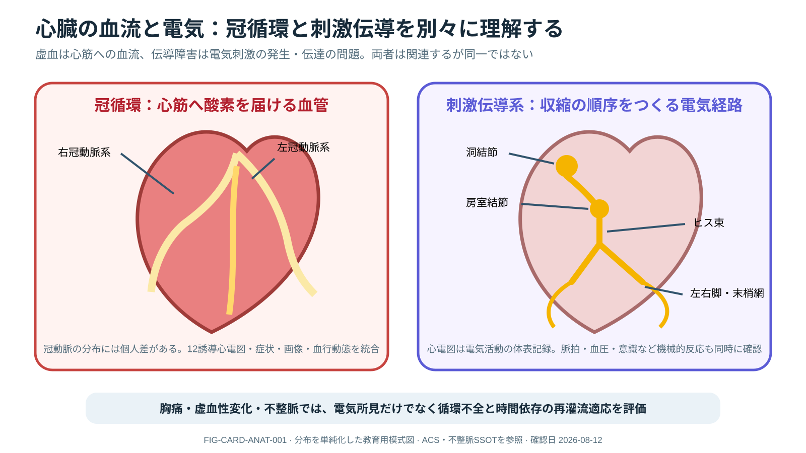

# Acute Coronary Syndrome



> [!NOTE]
> 左は冠動脈による心筋血流、右は洞結節から心室へ広がる電気刺激の概念です。冠動脈分布には個人差があり、図だけで責任血管や虚血部位を断定しません。

## 0. まず覚える

急性冠症候群（acute coronary syndrome: ACS）は、心臓を養う冠動脈の血流が急に減り、心筋が虚血または壊死に陥る病態の総称である。**胸痛がない患者もいるため、症状、12誘導ECG、troponin、循環状態を時間経過で統合する。**

**簡単に言うと：** 心筋が酸素不足に陥っている可能性を素早く見つけ、必要な患者を冠血流再開（reperfusion）へつなぐ時間依存性疾患である。

冠循環は心筋へ酸素と栄養を届ける血流です。刺激伝導系は心拍の電気的な順序を作ります。虚血により不整脈が起こることはありますが、心電図の電気所見と実際の脈拍・血圧・心拍出は同じものではありません。

| 用語 | 意味 | 実践上のポイント |
|---|---|---|
| ACS | 不安定狭心症、NSTEMI、STEMIを含む臨床症候群 | 単一検査ではなく症状・ECG・troponinの推移で評価 |
| ischemia | 血流不足により心筋の酸素需要を満たせない状態 | 壊死前ならtroponinが上昇しないこともある |
| STEMI / NSTEMI | ECGの持続性ST上昇の有無などで分類する心筋梗塞 | どちらも重症化しうる。治療経路と緊急度は全体像で決める |
| troponin | 心筋傷害で血中に増える蛋白 | 高値＝必ず冠動脈血栓ではなく、変化量と臨床像を統合する |
| reperfusion | PCIなどで虚血心筋への血流を再開すること | 適応患者では遅延を避け、実施後も再閉塞と合併症を監視する |

**新人看護師の到達点：** 発症時刻、症状の性状・変化、12誘導ECGと反復時刻、薬剤・allergy・出血risk、vital、末梢灌流を一つのtimelineにし、再胸痛・ST変化・不整脈・肺水腫・shockを即時報告できる。

> **報告例：** 「20分前から胸部圧迫感が再燃し、冷汗と血圧低下があります。12誘導ECGで新しいST変化を認め、酸素化は保たれています。ongoing ischemiaと循環不安定を疑い、cath lab activationを含む至急評価をお願いします。」

**ベテラン向け深掘り：** 高齢者、女性、糖尿病、腎機能障害では非典型症状を考慮する。type 1 MI、type 2 MI、非虚血性myocardial injuryを混同せず、大動脈解離・肺塞栓・心筋炎など抗血栓療法が有害になりうる鑑別を短時間で確認する。

## Recognize and activate

胸痛だけでなく呼吸困難、悪心、失神、shock、心停止を含む。12-lead ECGを迅速に取得し、診断困難/症状持続時はserial ECG、posterior/right-sided leads、troponin trend、POCUS/echo、aortic dissection・PE・myocarditis等を統合する。

> [!CAUTION]
> 単回の正常ECG/troponinで早期ACSを除外しない。一方、抗血栓治療前に大動脈解離、活動性出血、頭蓋内病変等の重大なmimic/contraindicationを短時間で確認する。

## Time-critical pathway

- persistent ST elevation/equivalent、ongoing ischemia、hemodynamic/electrical instabilityではcath lab/cardiologyを即時activate。
- aspirin、P2Y12 inhibitor、anticoagulation、lipid therapyはACS phenotype、PCI/CABG strategy、bleeding、renal function、併用薬に応じcurrent guideline/local protocolで選ぶ。
- oxygenはhypoxemia等の適応にtitrateし、routine hyperoxiaを避ける。
- cardiogenic shockではculprit revascularizationを急ぎ、multivessel interventionやMCSをroutine化せずindividual risk/benefitで決める。

## ICU surveillance

再胸痛/ST変化、arrhythmia、acute MR/VSD/free-wall rupture、RV infarction、pulmonary edema、shock、vascular/access bleeding、contrast-associated kidney injuryを監視する。突然の低血圧は“MIだからpump failure”と固定せず、機械的合併症、出血、tamponade、薬剤を再評価する。

再灌流後も`pain–ST–rhythm–perfusion`を同じtimelineで追い、no-reflow、stent thrombosis、recurrent ischemiaを拾う。抗血栓薬の種類・最終投与時刻・腎機能・出血部位と、CABG/手技予定をhandoverする。

```text
symptoms / instability → ECG + monitoring + focused differential
→ STEMI-equivalent or ongoing ischemia/instability?
  yes: reperfusion pathway now
  no: serial ECG/troponin + risk-directed imaging/testing
→ reassess ischemia, bleeding, shock, mechanical complication
```

## Nursing safety

- 症状・ECG・薬剤・採血・activation・balloonまでの時刻を一つのtimelineにする。
- antithrombotic投与前後の体重、腎機能、既往薬、出血、access site、末梢循環を確認。
- 新規murmur、肺水腫、再痛、ST再上昇、VT/VF、徐脈、意識/尿量低下は即時escalation。

## References

1. Rao SV, et al. 2025 ACC/AHA/ACEP/NAEMSP/SCAI Guideline for the Management of Patients With Acute Coronary Syndromes. J Am Coll Cardiol/Circulation. 2025. [Official guideline hub](https://professional.heart.org/en/guidelines-statements/2025-accahaacepnaemspscai-guideline-for-the-management-of-patients-with-acutecir0000000000001309).

## Review log

- 2026-08-12: V2導入、ACS/虚血/troponin等の用語、新人のtimeline観察・報告、myocardial injury鑑別を追加。2025 ACC/AHA公式sourceを再確認。
- 2026-08-12: reperfusion後trajectory、抗血栓handover、機械的合併症の再評価を深化。local review required.
- 2026-08-11: 2025 guideline review.
