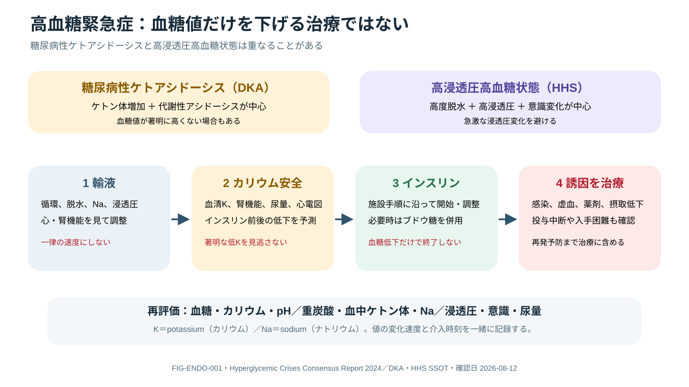

# DKA and HHS

## 0. まず覚える

DKA（糖尿病性ketoacidosis）はinsulin不足でketoneが増え、代謝性acidosisを来す病態である。HHS（高浸透圧高血糖状態）は著明な高血糖と脱水・高浸透圧が中心で、両者は重なることがある。

**簡単に言うと：** glucoseだけを下げる治療ではない。輸液、K、insulin、原因治療を並行し、DKAではketosis/acidosis、HHSでは浸透圧と意識まで改善したかを確認する。

| 用語 | 意味 | 実践上のポイント |
|---|---|---|
| ketone / β-hydroxybutyrate | 脂肪分解で生じる酸性物質 / DKAで中心となるketone | 尿ketoneより血中β-hydroxybutyrateが病勢・改善を反映しやすい |
| metabolic acidosis | 酸の増加などで血液pH/HCO₃が低下した状態 | 呼吸性代償、lactate、腎障害、Cl負荷も区別する |
| osmolality | 血液中の溶質濃度を表す指標 | HHSでは変化が速すぎないか、Na・意識とともに追う |
| euglycemic DKA | glucoseが著明に高くなくてもketosisとacidosisがあるDKA | SGLT2 inhibitor、妊娠、摂取低下などで見逃さない |
| corrected sodium | 高血糖による水移動を考慮して解釈するNa | measured Naだけで輸液方針を決めない |
| resolution | 急性代謝異常が治療終了基準まで改善した状態 | glucose低下のみを治癒としない |

**新人看護師の到達点：** glucose、K、pH/HCO₃、β-hydroxybutyrate、Na/osmolality、意識、尿量を時刻付きで追い、輸液・insulin・K・dextrose変更との前後関係を説明できる。insulin中断、栄養変更、低血糖・低K・神経悪化を即時報告する。

> **報告例：** 「glucoseは210 mg/dLまで低下しましたが、β-hydroxybutyrate高値とacidosisが残っています。Kも低下傾向です。glucoseだけでinsulinを終了せず、K補正とdextrose併用を含むprotocol再評価をお願いします。」

**ベテラン向け深掘り：** HHS・DKA overlap、SGLT2関連euglycemic DKA、心腎機能低下、妊娠を区別する。anion gapは高Cl性acidosisで誤解しうるため、β-hydroxybutyrateとpH/HCO₃を優先し、再発予防ではinsulin accessや社会的barrierまで介入する。

## Diagnose the physiology

2024 consensusではDKAをdiabetes/hyperglycemia、ketosis、metabolic acidosisの組合せで捉え、HHSをsevere hyperglycemia/hyperosmolality、著明なketosis/acidosisを欠く状態として扱う。overlapは珍しくない。SGLT2 inhibitor関連ではglucoseが高度でないeuglycemic DKAもある。

> [!CAUTION]
> glucose低下だけを「治癒」としない。DKAはketosis/acidosis、HHSはosmolality/mentationを含むresolution criteriaで判断する。尿ketoneはβ-hydroxybutyrateの変化とずれる。

## Initial assessment

- ABCDE、volume/perfusion、意識、infection/ischemia、妊娠、薬剤・insulin interruption
- glucose、electrolytes、creatinine、venous pH/bicarbonate、β-hydroxybutyrate、effective/total osmolality、ECG
- corrected sodiumの概念を使い、measured sodium単独でfluidを決めない
- trigger: infection、MI/stroke、pancreatitis、steroid、SGLT2、pump failure、access/adherence barrier

## Parallel treatment loop



**Figure FIG-ENDO-001 — 高血糖緊急症の並行治療。** 糖尿病性ケトアシドーシス（diabetic ketoacidosis：DKA）と高浸透圧高血糖状態（hyperosmolar hyperglycemic state：HHS）を比較し、輸液、カリウム安全、インスリン、誘因治療を並行する。改善判定は血糖値だけでなく、ケトン体、酸塩基、浸透圧、意識、尿量を含める。

1. **Fluid:** 年齢、心腎機能、shock、sodium/osmolality trendで選択・速度を調整。
2. **Potassium:** total-body depletionを前提に、血清Kと尿/腎機能を確認。著明な低Kではinsulin開始より安全な補正を優先する。
3. **Insulin:** protocol-based infusion/subcutaneous pathwayを重症度で選び、glucose低下後もketosis解消までdextrose併用で継続する場合がある。
4. **Phosphate/bicarbonate:** routineではなく、重度欠乏/特定状況を施設protocolと専門家で判断。
5. **Trigger:** infection/ischemia等を同時治療し、insulin access・educationまで修正。

```text
DKA/HHS/overlap → fluid + K safety + insulin + trigger
→ glucose / K / pH-HCO3 / βOHB / Na-osmolality / neuro trend
→ adjust without rapid osmotic shift or hypoglycemia
→ biochemical resolution + SC insulin overlap + prevention plan
```

## Complications and nursing

hypoglycemia、hypokalemia、hyperchloremic acidosis、fluid overload、thrombosis、cerebral edema/neurological deteriorationを監視する。採血/point-of-care値、infusion変更、fluid、尿量、意識をtimestampし、insulin中断やbasal insulin gapをhandoverで防ぐ。

補正Naとosmolalityの変化速度、K採血時刻とinsulin変更の前後関係を一つのflow sheetにする。anion gapだけではhyperchloremic acidosisをDKA遷延と誤認し得るため、可能ならβ-hydroxybutyrateとpH/HCO₃を用いる。皮下insulin移行は食事、basal投与、静注終了のoverlapを患者別に確認する。

## Prevention before discharge/transfer

precipitant、SGLT2 inhibitor/insulin pump、sick-day rule、ketone測定、insulin確保、費用・認知・言語・住居など再発barrierを確認する。euglycemic DKAではglucose正常化を安全宣言にしない。

## References

1. Umpierrez GE, et al. Hyperglycemic Crises in Adults With Diabetes: A Consensus Report. Diabetes Care. 2024;47:1257-1275. DOI: `10.2337/dci24-0032`; PMID: `38907161`.

## Review log

- 2026-08-12: V2導入、ketone/osmolality/euglycemic DKA等の用語、新人のflow-sheet観察・報告、resolution判断を追加。2024国際consensusを再確認。
- 2026-08-12: osmolality/K timeline、β-hydroxybutyrate-based resolution、transition/recurrent-barrier safeguardsを深化。local review required.
- 2026-08-11: 2024 consensus review.
