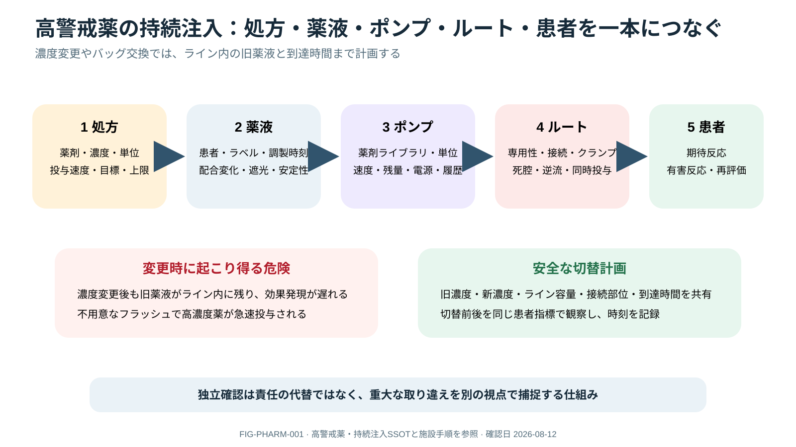

# High-alert Infusions and Medication Safety



> [!NOTE]
> 持続注入を「ポンプ設定」だけでなく、処方から患者反応まで一本につなげて確認する図です。濃度変更時はライン内に残る旧薬液と患者への到達時間も計画します。

## 0. まず覚える

high-alert medication（ハイアラート薬）は、誤りが起きたときに患者へ重大な害を与えやすい薬剤である。安全な持続投与には、**患者・薬剤・濃度・単位・line・pump・期待する反応を一続きで照合する**必要がある。

**簡単に言うと：** pump画面が合っていても安全とは限らない。薬液が正しい患者の正しいlineから届き、期待した効果が出ているところまで確認する。

| 用語 | 意味 | 実践上のポイント |
|---|---|---|
| high-alert medication | 誤使用時に重大な害を生じやすい薬剤 | standard濃度、独立double check、厳密な監視を優先する |
| independent double check | 二人が独立して計算・照合する確認 | 先行者の答えを見て追認せず、不一致解消まで開始しない |
| smart pump / drug library | dose limit等を備えた輸液pumpと薬剤database | wrong patient/line/productは防げない |
| dead space | 接続部から患者までのline内容量 | 低流量では設定変更の到達が遅れ、flushでbolusとなりうる |
| carrier fluid | 主薬をline内で運ぶ併用輸液 | 中断・速度変更で薬剤到達量が急変する |
| extravasation | 薬液が血管外へ漏れること | 部位と末梢循環を確認し、薬剤別の緊急対応へつなぐ |

**新人看護師の到達点：** original order、患者、体重、薬剤・濃度、dose単位、route/lumen、pump channelを独立照合し、bagから患者まで物理的にline traceできる。濃度・carrier・pump交換後は患者反応を再評価する。

> **報告例：** 「noradrenaline濃度変更後、設定上のdoseは同じですが血圧が急上昇しました。旧濃度がline内に残り、carrier変更でbolusされた可能性があります。投与を安全化し、line dead spaceを含む再確認をお願いします。」

**ベテラン向け深掘り：** barcodeやinteroperabilityを完全防御とせず、override、downtime、搬送、multi-lumen、単位変換、NMBA中の無意識下苦痛をsystem hazardとして設計する。near missを個人注意で終わらせず、濃度標準化・library・label・workflowへ戻す。

## Five linked checks

indication → patient/weight → drug/concentration/unit → line/pump/library → effect/toxicity。vasoactive、insulin、anticoagulant、opioid/sedative、NMBA、electrolyte concentrateは独立double checkとstandard concentrationを優先する。

## Medication-to-patient closed loop

```text
order/goal → verified product and concentration → programmed unit/rate
→ physical line trace → observed delivery → expected patient response
→ unexpected response = patient + drug + line + pump reassessment
```

barcode、EHR interoperability、dose error-reduction softwareは防御層であり、patient/line/product確認を置換しない。

## Independent double check

二人目は一人目の画面/計算を追認せず、original order、patient weight、product concentration、dose/rate/unit、route/lumenを独立に導出して比較する。不一致を解消するまで開始しない。全薬剤への形式的double checkではなく、high-risk stepへ集中する。

## Infusion line safety

- line traceをbag/syringeからpatientまで物理的に行い、lumen label、compatibility、dead spaceを確認。
- carrier変更、bolus、line flush、transport pump交換で突然doseが変わる。
- smart-pump library overrideはemergency indicationを明確にし、事後reviewする。
- NMBAにはventilation/sedationを別々に保証し、paralyzed patientのdistressを防ぐ。

### Dead space and delayed delivery

低流量、長いextension、多lumen、carrier停止では、pump開始/変更とpatient到達に遅れが生じる。flushやcarrier増加は残存high-alert drugをbolusし得る。line volume、carrier、接続位置を把握し、dose change後のresponse timingを過信しない。

### Concentration change

new bag/syringeをbedsideへ持ち込む前にdrug/concentrationを声に出して照合し、pump rate、line内旧濃度、移行方法、patient monitor、backupをbriefする。旧bagを同時に残さず、labelとEHR/pump表示を一致させる。

> [!DANGER]
> mcg/kg/min、mcg/min、mg/h、units/hの単位変換を暗算・口頭だけで行わない。濃度変更時はrateを再計算し、旧bag/line dead spaceを含め二者確認する。

## Smart-pump safety

- drug library/profileを選び、hard/soft limitと単位を確認する。
- overrideは理由、緊急性、dose妥当性を明確にし、eventをreviewする。
- pump表示がorderと一致しても、wrong channel/line/patient/productを除外できない。
- unexplained alarm、damaged housing、battery/software/user-interface problemでは患者を守る代替pump/手動計画を開始し、機器をtag/sequesterして施設手順で報告する。

FDAはpump問題がover/under-infusion、治療遅延につながり、software、interface、mechanical、battery failureが関与し得ると説明している。

## Drug-specific forcing questions

| Class | Before/while infusing |
|---|---|
| Vasoactive | dedicated lumen、concentration/unit、peripheral site、extravasation plan、rapid backup |
| Insulin | glucose source/intake、K、sampling timing、interruption/transition、hypoglycemia rescue |
| Anticoagulant | indication/target、weight、renal/hepatic function、baseline/serial labs、bleeding/reversal |
| Opioid/sedative | pain/sedation goal、ventilation、accumulation、delirium、daily liberation |
| NMBA | airway/ventilation、analgesia/sedation、monitoring、eye/skin/VTE care、stop test |
| Concentrated electrolyte | central/peripheral suitability、maximum concentration/rate per local policy、ECG/renal function、recheck |

## Transitions and downtime

OR/CT/transport、EHR downtime、central-to-peripheral transition、pump replacementではactive infusions、concentration、remaining volume、next syringe、battery、backup薬、stop/hold conditionsをbriefする。extravasation、line occlusion、unexpected BP/glucose/sedation変化はdelivery failureを疑う。

### Handoff minimum dataset

drug/indication、concentration、dose and unit、weight used、route/lumen/site、carrier、remaining time、last/next lab、target/response、toxicity、backup、contingencyをread-backする。

## References

1. ISMP. 2024–2025 Targeted Medication Safety Best Practices for Hospitals. https://www.ismp.org/guidelines/best-practices-hospitals
2. ASHP Guidelines on the Safe Use of Automated Dispensing Cabinets. Am J Health Syst Pharm. 2022. DOI: `10.1093/ajhp/zxab325`.
3. FDA. [Infusion Pump Risk Reduction Strategies for Clinicians](https://www.fda.gov/medical-devices/infusion-pumps/infusion-pump-risk-reduction-strategies-clinicians).
4. ASHP. [Standardization of Medication Concentrations, Dosing Units, Labeled Units, and Package Sizes](https://www.ashp.org/pharmacy-practice/policy-positions-database/2023/2319). 2023.

## Review log

- 2026-08-12: V2導入、high-alert薬、独立double check、dead space等の用語、新人のline trace・報告、system hazardを追加。ISMP 2024–2025を再確認。
- 2026-08-12: medication-to-patient loop, independent check, dead space, concentration change, smart-pump failure, class forcing questions, and handoff expanded.
- 2026-08-11: ISMP/ASHP review; local pharmacy/pump-library validation required.
