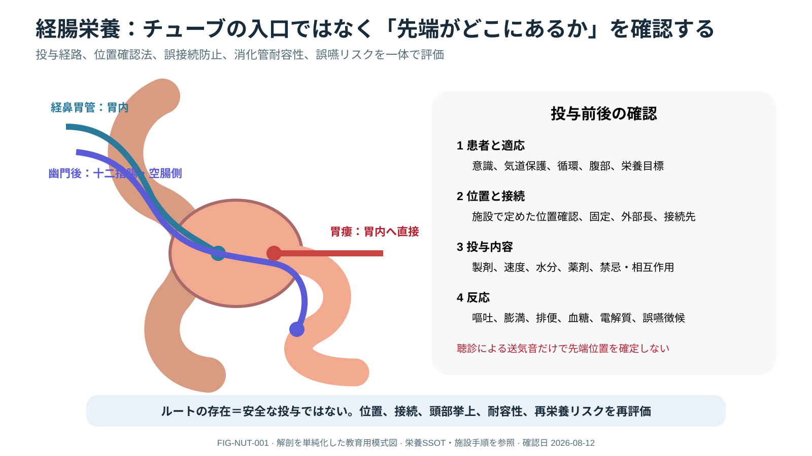

# Critical Care Nutrition



> [!NOTE]
> 経腸栄養ルートは入口ではなく先端位置で区別します。図は解剖を単純化しており、実際の位置確認法と投与可否は施設手順、画像、患者状態を用いて判断します。

## 0. まず覚える

重症患者の栄養療法は、単にcalorieを満たすのではなく、病期、消化管灌流、栄養risk、臓器supportに合わせて**安全に開始し、実投与量と耐容性を再評価する治療**である。

**簡単に言うと：** 処方した量ではなく実際に届いた量を数え、腸が安全に使えるか、過不足が患者の回復を妨げていないかを見る。

| 用語 | 意味 | 実践上のポイント |
|---|---|---|
| EN | enteral nutrition、経腸栄養 | 消化管を用いる栄養。oral不十分で腸が使用可能なら検討 |
| PN | parenteral nutrition、静脈栄養 | 消化管を介さず静脈から栄養を投与する方法 |
| delivered dose | 実際に患者へ投与された栄養量 | 中断、propofol、dextrose、citrateも24時間で集計する |
| feeding intolerance | 栄養投与を安全に進めにくい状態 | 胃残量だけでなく腹部、嘔吐、便、灌流、lactateを統合 |
| indirect calorimetry | 呼吸gasからenergy消費を推定する測定 | 利用可能なら処方精度を高めるが、病期で再評価する |
| aspiration | 口腔・胃内容が気道へ流入すること | 体位、嚥下、意識、tube、嘔吐、口腔careを確認する |

**新人看護師の到達点：** formula、route、rate、tube位置確認、実投与量、中断理由、腹部・便・嘔吐、glucose/TG/electrolyte、誤嚥徴候を記録し、hold後の再開時刻と責任者を明確にできる。

> **報告例：** 「処方は目標量ですが、検査と処置で過去24時間の実投与は45%です。腹部所見と灌流は安定しています。回避可能な中断を減らし、再開・補完計画を確認してください。」

**ベテラン向け深掘り：** shock、腸管虚血、active bleeding、IAH/ACSではEN安全性を優先し、gastric residual単独で中断しない。acute early phaseのoverfeeding、CO₂ burden、fluid、KRTによる栄養損失、PN感染riskと機能回復を統合する。

## Assess and prescribe as a trajectory

admission時にpre-illness intake/weight loss、body composition、frailty、GI function、dysphagia、refeeding riskを評価する。albumin/prealbumin単独をnutrition status markerにしない。daily intakeの**delivered dose**（nutrition、propofol、dextrose、citrate等）と目標との差を記録する。

## Nutrition problem representation

```text
baseline nutrition + illness phase/severity + GI function/perfusion
→ aspiration/refeeding risk + organ support + current delivered intake
→ route and starting strategy → monitoring → advancement/hold trigger
```

screening scoreだけで処方を決めず、weight historyの信頼性、edema、muscle loss、functional baseline、最近の摂取、wound/loss、goals of careをdietitianを含むteamで確認する。

## Route and timing

oralが不十分でGI tractが利用可能ならearly enteral nutritionを検討する。uncontrolled shock/ischemia、active GI bleeding、obstruction/compartment syndrome等ではsafetyを再評価する。EN intoleranceをgastric residual単独で決めず、pain/distension/vomiting、stool、perfusion、lactate、imagingを統合する。

PNはEN不可能/不十分、nutrition risk、illness phaseを多職種で判断し、line/infection、glucose、electrolyte、liver/TGを監視する。

### Route decision

| Route | Use when | Main safety questions |
|---|---|---|
| Oral | alertness、swallow、intakeが安全/十分 | aspiration、fatigue、texture、assistance |
| Gastric EN | GI tract利用可能、oral不十分 | tube position、head position、vomiting/distension、perfusion |
| Post-pyloric EN | aspiration/intolerance等で適応がある | placement confirmation、delay、clogging、drug delivery |
| PN | ENが不可能/不足しbenefitがriskを上回る | line、compatibility、glucose/TG/electrolyte、infection、overfeeding |

routeは固定ではない。毎日oral/ENへの移行、supplemental PNの必要性、access removalを再評価する。

## Energy and protein

indirect calorimetryが利用可能ならenergy prescriptionに用い、なければ推定式の不確実性を認識する。acute early phaseにfull feedingを急がず段階的に進め、proteinもrenal/hepatic/KRT、wound、rehabilitation、toleranceで個別化する。

### What counts toward delivery

formulaだけでなくpropofol lipid、IV dextrose、citrate、oral supplements、PN、procedureによる中断を同じ24-hour recordへ集約する。prescribed rate、actual delivered volume、cumulative deficitを区別し、中断理由を改善可能/不可避に分ける。

## Enteral intolerance: do not use one signal

abdominal pain/distension、vomiting/regurgitation、stool/ostomy、intra-abdominal pressure/obstruction concern、hemodynamics/vasopressor trajectory、lactate/perfusion、imaging、aspiration signsを統合する。gastric residual volume単独でbowel ischemiaを診断・除外せず、routineな中断でunderfeedingを作らない。

## Organ support modifiers

- ventilation：overfeedingによるCO₂ burden、proning/procedure時の安全、weaningと筋機能。
- KRT/CRRT：amino acid/micronutrient loss、electrolyte、fluid volume。透析液/補充液のsubstrateも確認。
- ECMO：fluid/edema、drug/nutrient delivery、mobilization、GI perfusionをteamで再評価。
- liver/renal dysfunction：一律のprotein restrictionではなく、indication、catabolism、encephalopathy/uremia、KRTを統合。

> [!CAUTION]
> “goal rate到達”だけを成功にしない。aspiration、bowel ischemia、overfeeding、hyperglycemia、hypercapnia、azotemia、electrolyte、fluid burdenと機能回復を追う。

## Daily nutrition round

route/access、delivered/held reason、energy/protein、GI tolerance、glucose/TG/electrolytes、fluid、bowel regimen、mobilization、procedure plan、next escalation/de-escalationを確認する。

### Nursing safety bundle

- patient/formula/route/rateとtube tip確認法を照合する。
- head/position、aspiration risk、oral care、tube fixation/skin、pump setを確認する。
- medicationをformulaへ混合せず、crushing可否、interaction、flush、clog preventionを薬剤師と確認する。
- diarrheaを直ちにEN intoleranceと決めず、drug、infection、osmotic load、bowel diseaseを評価する。
- hold criteriaと再開責任者/時刻を明記し、「念のため中止」のまま放置しない。

## References

1. Compher C, et al. ASPEN Guidelines for Provision of Nutrition Support Therapy in Adult Critically Ill Patients. JPEN. 2022. DOI: `10.1002/jpen.2267`; PMID: `34784064`.
2. Singer P, et al. ESPEN practical and partially revised guideline: Clinical nutrition in the ICU. Clin Nutr. 2023. DOI: `10.1016/j.clnu.2023.07.011`; PMID: `37517372`.
3. ASPEN. [Guidelines & Standards](https://nutritioncare.org/clinical-resources/guidelines-standards/).
4. ESPEN. [Practical guideline: Clinical nutrition in the ICU](https://www.espen.org/files/ESPEN-Guidelines/ESPEN_practical_and_partially_revised_guideline_Clinical_nutrition_in_the_intensive_care_unit.pdf). 2023.

## Review log

- 2026-08-12: V2導入、EN/PN、実投与量、耐容性等の用語、新人の投与・再開報告、病期別判断を追加。ASPEN/ESPEN公式資料を再確認。
- 2026-08-12: nutrition representation, route table, delivered dose, intolerance, organ support, and nursing safety expanded.
- 2026-08-11: ASPEN/ESPEN review; dietitian/pharmacy/local feeding protocol review required.
