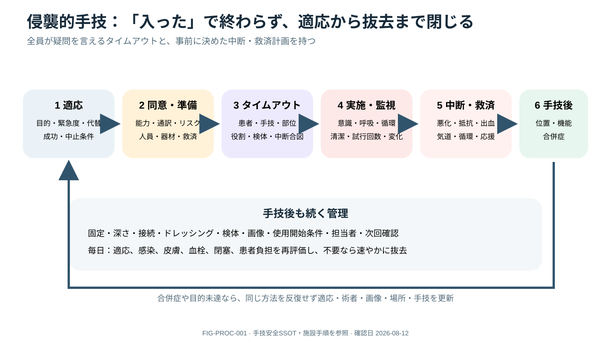

# Procedural Safety Framework

> [!NOTE]
> タイムアウトは開始直前の確認だけでなく、適応、同意、監視、中断、救済、位置・機能・合併症確認へつながる一工程です。術者や手技が変われば再確認します。

## 0. まず覚える

侵襲的手技の安全は、穿刺や挿入の技術だけで決まらない。**適応、同意、team timeout、監視、救済準備、合併症確認、記録、device抜去まで**を一つのprocedure lifecycleとして扱う。

**簡単に言うと：** 「入った」で終わらず、正しい患者・部位・手技か、機能しているか、合併症がないか、いつ抜くかまで閉じる。

| 用語 | 意味 | 実践上のポイント |
|---|---|---|
| indication | 手技を行う医学的理由 | 結果やdeviceが治療をどう変えるかを明示する |
| informed consent | 利益・risk・代替・行わない選択を理解した同意 | 署名だけでなくcapacity、通訳、surrogateを確認する |
| timeout | 開始前にteam全員で患者・手技・部位・risk等を確認する中断 | 全員が作業を止め、疑問を言える状態で行う |
| abort criterion | 手技を中断・撤退する条件 | unexpected pain、抵抗、低酸素、低血圧等を事前共有する |
| rescue plan | 合併症時の救済手段と人員・器材 | airway、出血、気胸、循環破綻を想定して準備する |
| post-check | 手技後の位置・機能・合併症確認 | device使用開始前に方法と責任者を明示する |

**新人看護師の到達点：** timeoutで患者、手技、部位/左右、体位、allergy、抗血栓薬、鎮静、検体、救済物品を声に出して確認し、手技中の呼吸・循環・意識変化を報告できる。終了後にdepth、固定、出血、機能、次回確認を記録する。

> **報告例：** 「中心静脈catheter挿入後、各lumenの機能は確認できましたが、SpO₂低下と右呼吸音低下があります。使用開始前に気胸を含む合併症確認をお願いします。」

**ベテラン向け深掘り：** 緊急時も可能な範囲の短いtimeoutを維持し、operator/site/手技変更や患者移動後は再timeoutする。同じ失敗方法を反復せず、attempt数と残るoptionを共有してoperator、imaging、場所、手技をescalateする。

## Before: indication, alternatives, rescue

procedureが結果/治療をどう変えるか、より安全なalternative、urgency、operator/supervision、consent、goals of careを確認する。anatomy/imaging、coagulation/antithrombotic、allergy、infection、pregnancy、airway/hemodynamic reserveをreviewし、合併症rescue resourcesを準備する。

## Procedure problem statement

`indication / expected decision or benefit / urgency / alternative / patient-specific hazards / success criterion / abort criterion / post-check`を一文で共有する。diagnostic procedureでは、結果がmanagementを変えないなら適応を再考する。

## Consent and capacity

benefit、material risks、alternatives、no procedure、operator/supervision、sedation、specimen/useを理解可能な方法で説明する。capacity、interpreter、surrogate、emergency exceptionと理由を記録し、署名だけをconsent完了とみなさない。

## Team timeout

patient、procedure、site/side、position、operator、imaging、antibiotic/antithrombotic plan、sedation/monitor、equipment、specimen、critical steps、stop/abort/rescue planを全員が声に出して確認する。emergencyでも短いtimeoutを可能な範囲で行う。

timeoutは全員が作業を止め、疑問を言える状態で行う。途中でoperator/site/procedureが変わる、患者移動後、複数手技を続ける場合は再timeoutする。

## During

- hand hygiene、skin antisepsis、appropriate barrier、sterile field、safe injection。
- continuous patient monitoringとobserver/medication roleを明確化。
- ultrasoundはprobe cover/gel、needle-tip visualization、image interpretation competencyを含む。
- unexpected resistance、pain、arrhythmia、hypoxia、hypotension、neurological changeでは停止して再評価。

## Sedation is a parallel procedure

sedation planはairway/aspiration、drug/weight/organ function、monitoring、independent observer、reversal/rescue、post-sedation discharge criteriaを持つ。operatorがsedation監視も兼ねる場合のriskを評価し、施設credentialingに従う。

## Attempts and escalation

attemptはskin punctureだけでなくneedle/device advancementやoperator交代を含め、回数・合併症・残るoptionsを共有する。難易度が上がるほど同じ方法を反復せず、position、imaging、operator、device、location/OR/IRへescalateする。

> [!CAUTION]
> “一回刺したから進める”を避ける。attempt数を共有し、help/escalation thresholdを事前に決める。成功したdevice placementと、機能/位置/合併症なしの確認は別工程。

## After

position/function、bleeding、pneumothorax/ischemia/neuro injury等をprocedure-specific methodで確認。specimen labelをbedsideで照合し、device depth/securement/dressing、post-care、restart medication、red flags、removal criteriaを記録する。合併症/near missはdebriefする。

### Procedure closure bundle

procedure/attempt/operator、device type/depth/site、specimen、estimated loss、medication/sedation、immediate result、position/function confirmation、complication surveillance、restart/hold medication、nursing instructions、patient/family explanation、review/removal ownerを閉じる。

## References

1. WHO. Surgical Safety Checklist and implementation resources. https://www.who.int/teams/integrated-health-services/patient-safety/research/safe-surgery
2. CDC. Core Infection Prevention Practices. https://www.cdc.gov/infection-control/hcp/core-practices/index.html

## Review log

- 2026-08-12: V2導入、適応・同意・timeout・中止/救済・post-checkの用語、新人の確認・報告を追加。WHO/CDC公式資料を再確認。
- 2026-08-12: problem statement, consent, re-timeout, sedation, attempt escalation, and closure bundle expanded.
- 2026-08-11: WHO/CDC safety framework review; credentialing/local procedure policy required.
