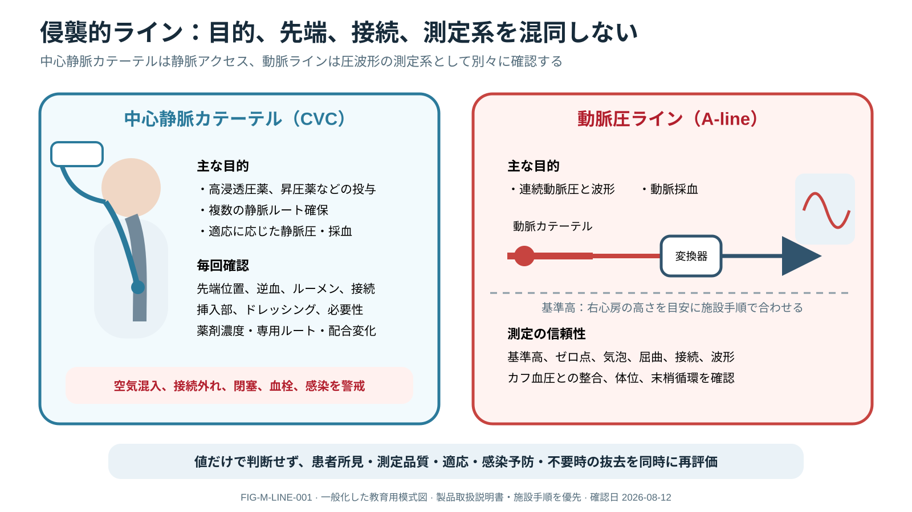

# Monitoring, Waveforms, and Artifact



> [!NOTE]
> 中心静脈カテーテルは主に静脈アクセス、動脈圧ラインは連続血圧と波形測定に用います。製品ごとの構造や操作は異なるため、取扱説明書と施設手順を優先します。

> [!NOTE]
> **図で確認：** [生体信号からモニター表示までの信号経路](../../../assets/monitoring/signal_chain_artifact.svg) — 患者の生理から表示までを逆にたどり、偽信号と真の急変を同時に評価する。

## 0. まず覚える

monitorは患者そのものではなく、sensorが拾った生体signalを機械が処理して表示したものである。異常値では、**まず患者を見て支え、signal chainを点検し、別の測定方法で照合する。**

**簡単に言うと：** 「本当の急変かartifactか」を画面だけで決めず、患者と測定系を同時に確認する。

トランスデューサー（transducer）は、カテーテル内の圧を電気信号へ変換する部品です。基準高のずれ、ゼロ点、気泡、血栓、屈曲、接続不良は表示値を変えるため、数字だけでなく波形と患者の灌流を照合します。

| 用語 | 意味 | 実践上のポイント |
|---|---|---|
| waveform | 時間に伴う生体signalの形 | 数字より先にquality、形、患者との一致を確認する |
| artifact | 体動・接触不良・機器などによる偽のsignal | artifactと本当の悪化は同時に存在しうる |
| pleth | pulse oximeterが表示する脈波 | SpO₂値の信頼性と末梢灌流の手掛かりになる |
| level / zero | 圧transducerの高さ合わせ / 大気圧基準設定 | 体位変更後に再確認し、systematic biasを防ぐ |
| damping | 圧波形の振動が過度に減衰・増幅する状態 | tubing、air、clot、flushと患者pulseを照合する |
| independent modality | 原理の異なる別の測定方法 | cuff BP、触診pulse、ABG等で異常値を確認する |

**新人看護師の到達点：** alarm時に意識、pulse、呼吸、皮膚/灌流を確認し、electrode/probe/catheter、cable/tubing、level/zero、設定を順に点検する。sensorや酸素設定変更の時刻と再評価値を記録できる。

> **報告例：** 「monitorはVT表示ですが、患者は会話可能でpulseとA-line波形があります。ECG electrode接触不良を確認中です。ただし胸部症状もあるため、artifact修正と12誘導ECG評価を並行してください。」

**ベテラン向け深掘り：** SpO₂の末梢灌流・体動・皮膚色素・dyshemoglobin、ETCO₂の肺血流・dead space、圧波形のhydrostatic biasを考慮する。単一値をtarget化せず、測定validity、baseline、trajectory、介入反応を統合する。

## A monitor measures a signal, not the patient

```text
unexpected value/alarm → look at patient/pulse/perfusion
→ signal source/sensor/catheter → cable/transducer/device/settings
→ compare independent modality → intervene → confirm response
```

## Signal chain

`physiology → sensor/interface → transmission/tubing → transducer/algorithm → display/alarm → clinician interpretation`の各段階でerrorが起こる。artifactと真の変化は同時に存在し得るため、signal修復とpatient supportを並行する。

## ECG

electrode contact/placement、lead selection、motion/electrical artifactを確認し、monitor rhythmをpulse/arterial waveformと照合する。ischemia/diagnosisにはappropriate 12-leadとserial changeを用い、single-lead telemetryだけで断定しない。QT interpretationはrate/QRS/lead/drug/electrolyteを考慮する。

alarm tachycardiaをECG rateだけでなくpulse/pleth/A-lineと照合し、double counting、lead reversal、pacing artifactを考える。asystole/VT表示でも患者と独立したpulse signalを即時確認する。

## SpO₂ and ETCO₂

SpO₂はpleth quality、perfusion、motion、pigmentation、dyshemoglobin、probe siteを確認し、疑わしければABG/co-oximetry等で照合する。ETCO₂はairway/ventilation、perfusion/cardiac output、dead space、sampling/circuit leakの影響を受け、PaCO₂とのgapは固定でない。

SpO₂ trendはprobe/site/device/oxygen settingが変わった時点を記録する。ETCO₂の突然消失はairway/circuit/sampling、severe low flow/arrestを緊急評価し、値の低下を単に「換気良好」と解釈しない。

## Invasive pressure

A-line/CVP等はtransducerをappropriate referenceへlevel/zeroし、bag pressure、tubing/air/clot、flush、dynamic response、waveform dampingを確認する。数値だけを補正せず、over/underdampingとpatient perfusionを評価する。

level errorはhydrostatic pressureとしてsystematic biasを作る。zero、level、patient position変更、square-wave/dynamic response、cuff/palpated pulseとの一致を確認する。CVP waveformはrhythm、ventilation、tricuspid/pericardial contextを含め、単一mean値でvolume statusを決めない。

## Output and organ monitors

CO/ScvO₂、ICP/CPP、urine output、temperature等は測定法、校正、time averaging、drain/clamp、diuretic/KRT、sedation/ventilationの影響を記録する。尿量低下ではcollection systemのkink/position/obstructionを患者病態と並行確認する。

> [!CAUTION]
> CVP、ScvO₂、lactate、CO、ICP、urine outputの単一値はdiagnosisでもtargetでもない。measurement validity、baseline、trajectory、intervention responseを統合する。

## Alarm design and handover

alarm limits/delayはpatient-specificに設定するが、危険alarmを無効化しない。baseline waveform screenshot/値、sensor/site、zero/reference、known limitation、次回校正/検査をhandoverする。alarm burdenはfalse alarmだけでなくmissed deteriorationもquality reviewする。

monitor開始/転棟時にpatient identity、profile、lead/source、alarm volume/priority、limits、remote monitoring、battery/networkを確認する。limit変更は誰がいつ戻すかを明記する。

## References

1. AARC Clinical Practice Guideline: Blood Gas Analysis and Hemoximetry. Respir Care. 2013. DOI: `10.4187/respcare.02786`.
2. FDA. Pulse Oximeters（精度の限界と影響因子を含む）. https://www.fda.gov/medical-devices/products-and-medical-procedures/pulse-oximeters
3. AACN. Practice Alert: Pulmonary Artery/Central Venous Pressure Monitoring in Adults. https://www.aacn.org/clinical-resources/practice-alerts

## Review log

- 2026-08-12: V2導入、waveform/artifact/pleth/level-zero/damping等の用語、新人の患者優先確認・報告を追加。FDA/AACN sourceを再確認。
- 2026-08-12: signal-chain, ECG/pulse verification, SpO₂/ETCO₂ transitions, invasive-pressure bias, organ monitor, and alarm ownership expanded.
- 2026-08-11: Primary/professional sources reviewed; biomedical/local monitoring validation required.
