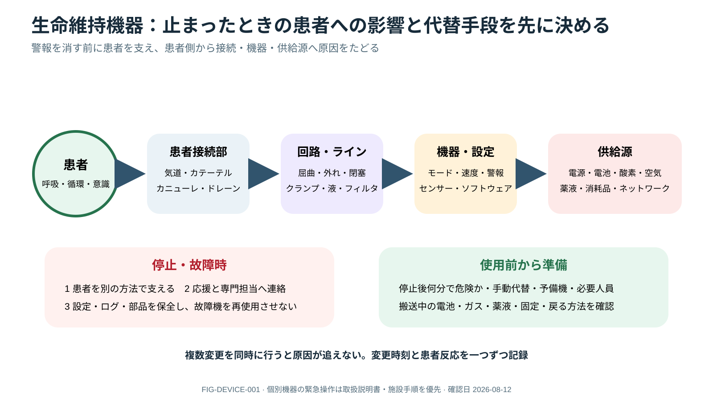

# Device Lifecycle and Backup Safety



> [!NOTE]
> 機器停止時は警報解除より先に患者を代替手段で支え、患者側から接続、回路、機器、電源・ガス・薬液へ原因をたどります。個別機器の操作は取扱説明書と施設手順を優先します。

## 0. まず覚える

生命維持deviceは、挿入・接続時だけでなく、適応決定、設定、固定、日常点検、故障時backup、抜去まで一連のlifecycleで管理する。**止まると何が起きるか、代替手段は何かを使用前から共有する。**

**簡単に言うと：** deviceのalarmを消すのではなく、患者を別の方法で支え、患者側から電源・gasまで原因をたどる。

| 用語 | 意味 | 実践上のポイント |
|---|---|---|
| device dependency | 患者の生命機能がdeviceへ依存する程度 | 停止後どれほど早く危険になるかを共有する |
| backup | device停止時の代替手段 | spare、手動support、必要人員、連絡先を準備する |
| securement | tube・line・cannula等を安全に固定すること | depth、皮膚、張力、体位変更後を確認する |
| connector / route | deviceやlineの接続部 / 投与経路 | 両端をtraceし、unknown lineへ注入しない |
| change control | 設定・部品・接続変更のriskを管理すること | 変更前に効果と害、変更後に患者反応を確認する |
| preventive maintenance | 故障前に行う定期点検・保守 | 期限、battery、消耗品、software/profileを確認する |

**新人看護師の到達点：** 各deviceの目的、設定、depth/固定、接続、電源・gas、alarm、出力、backupを確認し、lineを挿入部から末端までtraceできる。故障時は患者supportを確保し、問題機器を再使用されないよう報告できる。

> **報告例：** 「人工呼吸器が停止し、manual ventilationで患者supportを確保しました。酸素源とairwayは確認済みです。故障機は設定とlogを保全して隔離し、代替器への安全な切替をお願いします。」

**ベテラン向け深掘り：** device交換・software/profile・filter・濃度・体位の複数変更を同時に行う場合はtimestampし、因果を追えるようにする。故障後は患者care優先のうえ、log・部品・写真を保全し、clinical engineeringとsystem reviewへつなぐ。

## Lifecycle

適応/goal → correct device/configuration → insertion/connection confirmation → secure/label → function/infection/skin daily checks → emergency backup → prompt removal。各deviceにowner、settings、dependencies、alarm response、removal/exit criteriaを持たせる。

## Dependency map

各deviceについて「停止すると何分で危険か」「何に依存するか」「manual代替は何か」を明示する。

| Device function | Dependencies | Backup question |
|---|---|---|
| Airway/ventilation | tube/trach、circuit、gas、power、humidification | bag-mask/manual ventilation、spare airway、trained help |
| Infusion | drug/product、line/lumen、pump、power、carrier | spare syringe/pump、manual emergency plan |
| Drainage | patient position、catheter、tubing、collection/suction | safe temporary management、specialist contact |
| KRT/ECMO/MCS | access/cannula、circuit、power/gas、anticoagulation、team | emergency card、manual/device-specific backup |

## Line and connector map

airway、vascular、enteral、neuraxial、drainを両端までtraceし、route-compatible connector、lumen purpose、concentration、direction of flowを表示する。接続変更、transport、handoff後にretraceする。unknown lineへ注入しない。

line mapはpatient側のinsertion site、external length/depth、connector、lumen purpose、downstream device、infusate/outputを対応させる。bedsideに余剰connector/注射器を放置せず、neuraxial/enteral/IV routeを物理的・運用的に分離する。

## Daily device round

- indicationはまだあるか、より低侵襲へ移行可能か
- insertion/depth/securement/dressing/skin/limb perfusion
- connections、kinks、clamps、filters、battery/gas/power、consumables
- expected value/outputとpatient response
- contamination/break、alarm/event、maintenance due
- manual alternative、spare device、trained responder、emergency contact

## Device change control

setting、software/profile、circuit component、filter、concentration、connection、patient positionを変える前にexpected effectとhazardをbriefし、変更後にpatient response、setting、connection、alarmを確認する。複数変更を同時に行う場合は時刻を記録する。

## Failure response

```text
recognize patient dependence → independent support
→ patient/interface → connection/circuit → device/settings
→ utilities/consumables → replace/escalate
→ preserve logs/device → report/debrief
```

故障機器は問題を具体的にtagし、再使用を防いでclinical engineering/manufacturer/local reportingへ渡す。patient careを確保した後、event log、settings、consumables、写真等を施設policyに従い保全する。

> [!DANGER]
> alarmを消すことは原因修正ではない。device failure時は患者supportを独立した方法で確保してから、patient side / connection / circuit / machine / utilitiesを確認する。

## Transport and downtime

必要薬/oxygen/battery残量をplanned duration以上で確認し、spare、route、elevator、receiving hookup、return/abort planをbriefする。EHR/network/power downtimeでもdevice settingsとoutputをpaper/independent recordへ保持する。

## References

1. FDA. Medical Device Safety and recalls resources. https://www.fda.gov/medical-devices/medical-device-safety
2. WHO. Medical equipment maintenance programme overview. https://www.who.int/publications/i/item/9789241501538

## Review log

- 2026-08-12: V2導入、dependency/backup/securement/connector/change control等の用語、新人のtrace・故障報告を追加。FDA/WHO sourceを再確認。
- 2026-08-12: dependency map, line map, change control, failure/log preservation expanded.
- 2026-08-11: Device safety framework review; biomedical engineering/manufacturer/local inventory review required.
