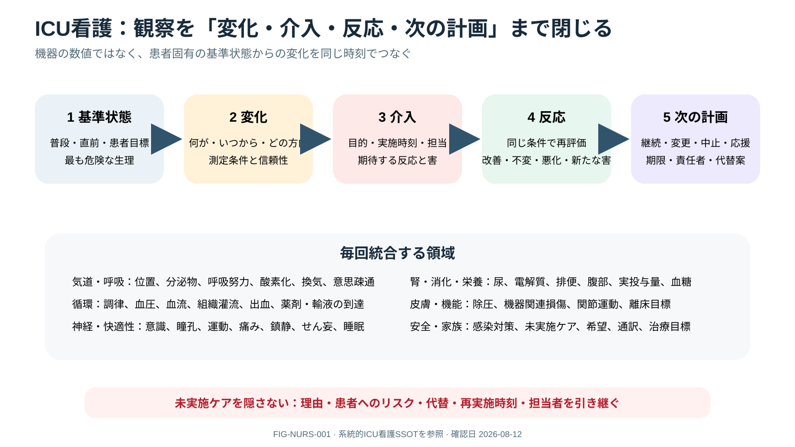

# Systematic ICU Nursing Care

> [!NOTE]
> 観察項目を並べるだけでなく、患者固有の基準状態から何が変わり、何を行い、どう反応し、次に誰がいつ何をするかまで一つの時間軸で閉じます。

## 0. まず覚える

ICU看護は、機器の数値を並べることではなく、**患者の最も危険な生理、baselineからの変化、介入への反応、本人の目標を一つの時間軸で捉え、teamへつなぐ実践**である。

**簡単に言うと：** 観察して終わらず、「何が変わったか、何を行い、どう反応し、次に何が必要か」まで閉じる。

| 用語 | 意味 | 実践上のポイント |
|---|---|---|
| trajectory | 時間経過に沿った病態の方向 | 単一値より改善・悪化・変動を捉える |
| baseline | 患者固有の普段または直前の基準状態 | 一般的正常値と患者の変化を区別する |
| escalation | より高い評価・治療・人員へ支援を拡大すること | threshold到達を待たず懸念と必要行動を伝える |
| closed-loop communication | 指示・報告を復唱し完了・結果まで確認する伝達 | 伝えたことと受領・実行されたことを分ける |
| omitted care | 必要だが未実施・延期されたcare | 理由、risk、代替、再実施時刻、ownerを可視化する |
| least restrictive alternative | 患者の自由を最も制限しない安全手段 | restraint・深鎮静・device追加の前に検討する |

**新人看護師の到達点：** ABCDE、device、薬剤、comfort、皮膚、機能、栄養、家族をsystematically観察し、変化・時刻・介入・反応・懸念・依頼を短く報告できる。未実施careを隠さずhandoverする。

> **報告例：** 「30分前から尿量と末梢灌流が低下し、MAPは維持されていますが乳酸が上昇しています。lineと測定系を確認し体位調整しましたが改善しません。occult shockを疑い、循環再評価をお願いします。」

**ベテラン向け深掘り：** workload下でtime-critical medication、turning、nutrition、mobility、family updateのどれが欠落しているかをsystem riskとして捉える。家族参加はdefaultで支えつつ、患者・家族の希望、privacy、公平性、通訳・digital accessを個別化する。

## Start with trajectory and patient goals

診断名だけでなく「今いちばん危険な生理」「baselineから何が変わったか」「次の悪化を何で捉えるか」「患者が大切にすること」をshift開始時に明確にする。ABCDE、head-to-toe、device、medication、comfort、function、familyを一つのtimelineで観察する。

## Core bedside domains

- airway/respiration: position、secretion、oral care、cuff/device、work of breathing、communication
- circulation: perfusion、rhythm、access、vasoactive delivery、fluid/output、bleeding
- neuro/comfort: pain、RASS、delirium、pupil/motor、sleep、withdrawal
- renal/GI/nutrition: urine、electrolyte、bowel、feeding tolerance、glucose
- skin/function: pressure/incontinence/device injury、turning、mobility goal、ROM
- infection/safety: hand hygiene、precautions、line necessity、fall/restraint、medication double checks

## Handoff and escalation

SBAR等でpatient-specific threat、trend、interventions and response、pending test、contingency/trigger、goals/code statusを伝える。気になる変化をscore閾値まで待たずescalateし、closed-loopで受領を確認する。documentationは“stable”でなくmeasurement conditionとtime courseを残す。

escalationは`何が変わった／いつから／何を試しどう反応した／最悪の懸念／今必要なこと`を一息で伝える。受領されない、評価が遅い、懸念が解消しない場合の第二経路をshift開始時に把握する。

> [!CAUTION]
> restraint、深鎮静、device追加は安全そのものではない。原因、least restrictive alternative、開始/解除条件、頻回再評価を必要とする。

## Family and end-of-life care

家族/重要他者をpatient preferenceに沿ってcare partnerとして迎え、daily goals、uncertainty、何を期待するかを共有する。終末期ではsymptom relief、privacy、cultural/spiritual need、device/monitor/medication simplification、family preparation、staff supportをplan化する。comfort medicationを生命短縮目的と混同せず、intentionとresponseを記録する。

family presenceを原則として支え、round参加やbedside careは希望・安全・privacyに合わせて選べるようにする。言語、障害、距離、経済、digital accessによる参加格差を記録し、interpreterや代替手段を早期に整える。

## Omission and workload safety

繁忙時ほど、time-critical medication、airway/device、turning/skin、nutrition、delirium/mobility、family updateの未実施を暗黙化しない。延期したcareは理由、risk、代替、再実施時刻、引継ぎ責任者をvisible taskとして残す。double-checkは署名数でなく独立した情報源からの照合にする。

## Shift checklist

最も危険な問題／today goal／lines-drains necessity／pain-sedation-delirium／mobility-skin／nutrition-elimination／family communication／未実施care／contingency／handoff gapsを確認する。

## References

1. SCCM ICU Liberation Bundle A–F. https://www.sccm.org/clinical-resources/iculiberation-home/abcdef-bundles
2. Davidson JE, et al. Guidelines for Family-Centered Care in the Neonatal, Pediatric, and Adult ICU. Crit Care Med. 2017. DOI: `10.1097/CCM.0000000000002169`; PMID: `27984278`.
3. Hwang DY, et al. SCCM Guidelines on Family-Centered Care for Adult ICUs: 2024. Crit Care Med. 2025;53:e465-e482. https://www.sccm.org/clinical-resources/guidelines/guidelines/guidelines-on-family-centered-care-for-adult-icus-2024

## Review log

- 2026-08-12: V2導入、trajectory/baseline/escalation/closed loop/未実施care等の用語、新人の報告例を追加。SCCM family-centered care 2024を再確認。
- 2026-08-12: escalation syntax/second path、equitable family presence、omitted-care visibility、independent double-checkを追加。local workflow review required.
- 2026-08-11: SCCM/family-centered sources reviewed.
