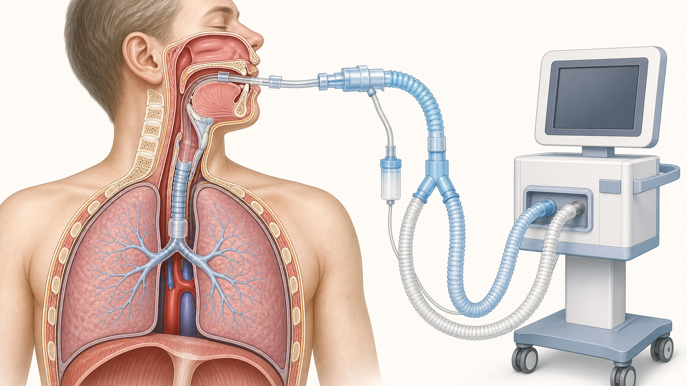
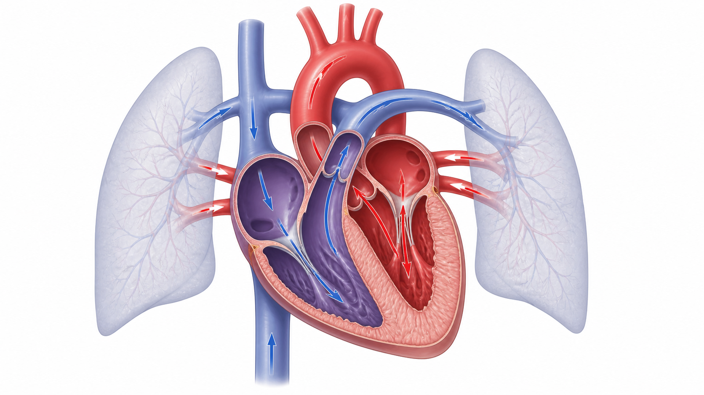
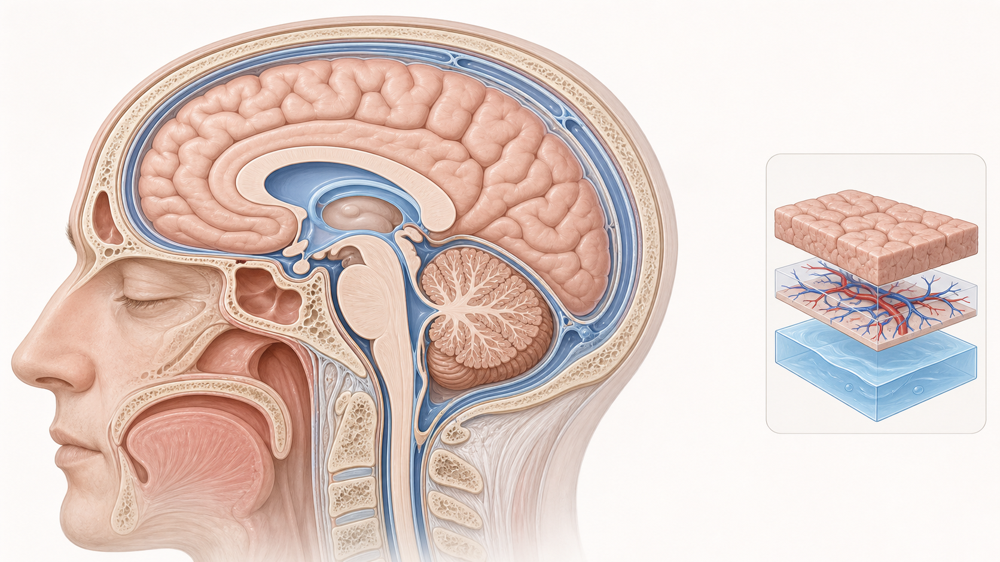
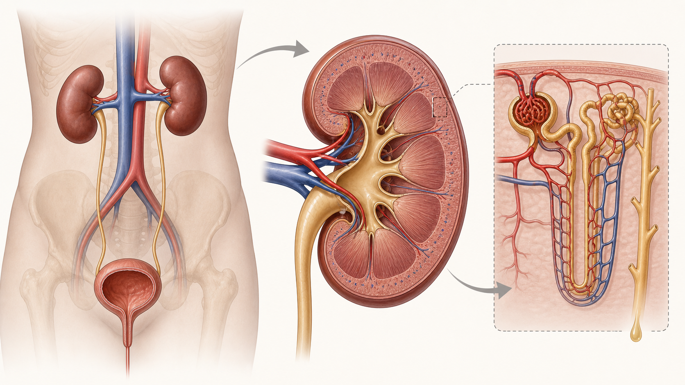
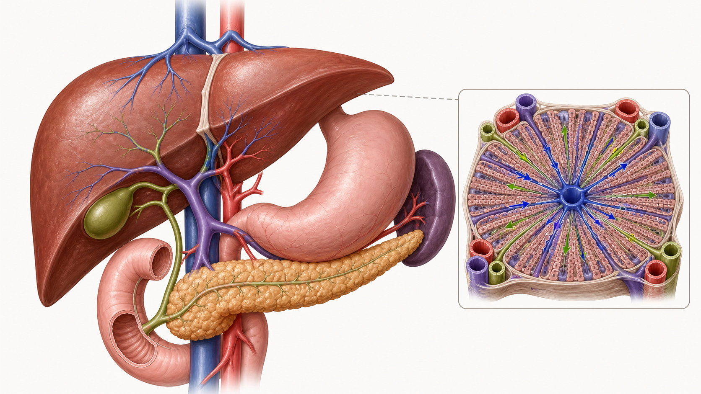
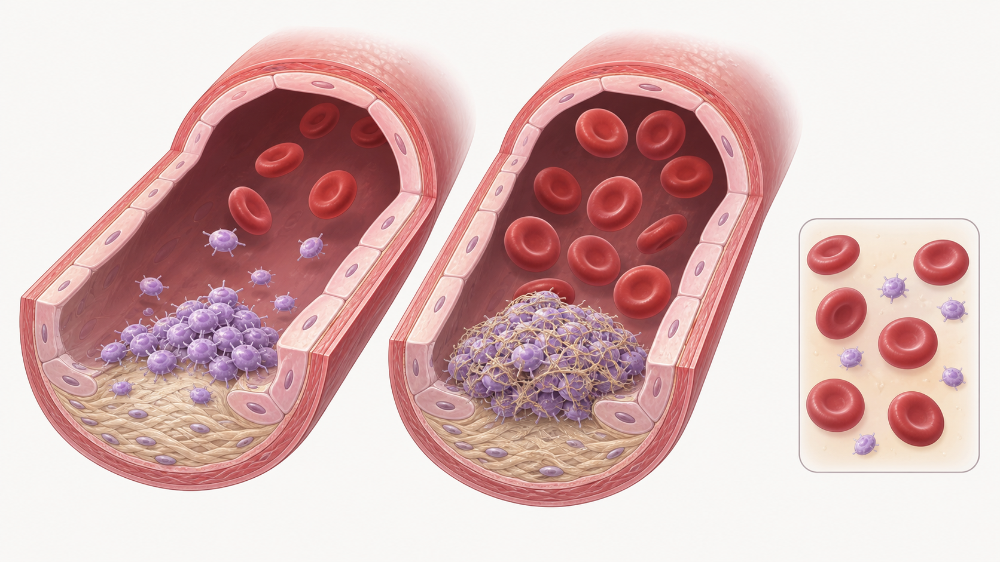
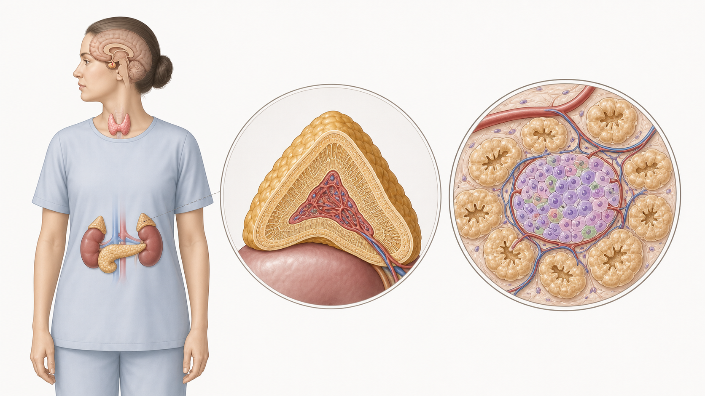

# 集中治療の解剖・医療機器イラスト集

文章やフローチャートを読む前に、構造と位置関係をつかむための導入教材です。診療手順や個別機器の取扱説明書を置き換えるものではありません。

## 気道・肺・人工呼吸器

- 気管チューブは声門を越えて気管内に入り、先端は気管分岐部より手前に位置します。
- 実際の深さや位置は体格、画像、呼気二酸化炭素波形、左右換気などを統合して確認します。
- 図の回路は一般化した教育用表現で、製品固有の構成を示しません。

関連：[気管チューブ・気管切開の管理](../01_Airway/Artificial_Airway_Care/ARTIFICIAL_AIRWAY_CARE.md)

## 心臓・肺循環

- 右心系から肺へ送られた血液は、肺静脈から左心系へ戻り、全身へ拍出されます。
- 色は経路を理解するための教育用表現であり、実際の血液色や酸素飽和度を定量表示しません。
- 圧、血流、組織灌流は同じ意味ではないため、患者所見と測定条件を合わせて判断します。

関連：[血行動態モニタリング](../03_Circulation/Hemodynamics/HEMODYNAMIC_MONITORING.md)

## 頭蓋内解剖

- 頭蓋骨内には脳実質、血液、脳脊髄液が存在します。
- 代償できる余地を超えると、わずかな容量増加でも頭蓋内圧が急上昇し得ます。
- 模式図であり、各成分の実際の容量比や患者固有の病変を示しません。

関連：[頭蓋内圧・脳灌流圧・重症頭部外傷](../04_Neurology/ICP_CPP_TBI/ICP_CPP_TBI.md)

## 腎臓・尿路・腎単位

- 腎臓への血流、糸球体での濾過、尿細管での再吸収・分泌、尿路からの排出を分けて理解します。
- 尿量低下は腎臓だけの問題とは限らず、測定、循環、静脈うっ血、閉塞、薬剤を同時に確認します。
- 腎単位の大きさと配置は学習用に強調されています。

関連：[急性腎障害](../05_Renal/AKI/AKI.md)

## 肝臓・胆道・膵臓・門脈循環

- 肝臓には門脈と肝動脈から血液が入り、肝静脈から下大静脈へ戻ります。
- 胆汁の経路と血流は異なるため、胆汁うっ滞、肝細胞障害、循環不全を分けて考えます。
- 肝小葉の挿入図は方向関係を強調した模式図です。

関連：[急性肝不全と肝性脳症](../11_GI_Liver/Acute_Liver_Failure/ACUTE_LIVER_FAILURE_HE.md)

## 血小板とフィブリン

- 血小板の粘着・凝集による一次止血と、フィブリンによる安定化を分けて理解します。
- 実際の凝固は相互作用する反応であり、単純な一方向のカスケードとして完結しません。
- DICでは血栓、消費、出血、臓器障害が併存し得ます。

関連：[DICと急性血小板減少](../12_Hematology/DIC_Thrombocytopenia/DIC_THROMBOCYTOPENIA.md)

## 内分泌臓器

- 下垂体、甲状腺、副腎、膵島の位置関係を示します。
- 副腎皮質・髄質、膵島は機能の異なる組織ですが、図は分泌量や病態の重症度を示しません。
- 内分泌緊急症では検査値だけでなく、循環、血糖、電解質、体温、意識を繰り返し評価します。

関連：[内分泌・体温緊急症](../10_Endocrine_Metabolic/Endocrine_Emergencies/ENDOCRINE_TEMPERATURE_EMERGENCIES.md)

## 品質上の扱い

解剖イラストは生成AIを利用した後、教材として目視選別しています。文字、診療手順、回路方向、数値目標は生成画像へ埋め込まず、SSOT本文と編集可能なSVGを正本とします。CRRT・ECMOのように接続関係が安全性へ直結する機器は、生成画像単独を採用せず、検証可能な回路SVGを優先します。
